# HƯỚNG DẪN SỬ DỤNG CHI TIẾT ỨNG DỤNG DOANH NHÂN CLB CEO 1983 & WEB CRM QUẢN TRỊ
**Hệ sinh thái:** VIONE Ecosystem · **Phân hệ:** CEO 1983 Association Mobile App & Web CRM Platform  
**Phiên bản:** v2.6.0 Pro · **Cập nhật:** Ngày 17/09/2026 · **Môi trường:** Live Production Staging  
**Tài liệu kèm hình ảnh minh chứng thực tế (100% Verified Real Screenshots từ Hệ Thống)**

---

## DANH MỤC TÀI KHOẢN THỰC THI KIỂM THỬ & VẬN HÀNH

| STT | Vai Trò (Role) | Email Đăng Nhập (Gmail / Domain) | Mật Khẩu | Pháp Nhân Doanh Nghiệp | Phạm Vi Sử Dụng |
|:---:|---|---|:---:|---|---|
| **1** | **Quản trị viên Hệ thống (Platform Admin)** | `admin@connect.vn` | `123456` | VIONE Holdings | Quản trị Web CRM (`:5000`), Phê duyệt hội viên, Đăng tin tức có ảnh, Đăng sự kiện, Marketplace, Sơ đồ khán phòng |
| **2** | **Tổng Thư Ký CLB (Executive Admin)** | `ceo.tongthuky@ceo1983.com` | `123456` | Ban Chấp Hành CEO 1983 | Điều hành CLB, kiểm duyệt nội dung, quản lý ban ngành |
| **3** | **Tân Hội Viên Phê Duyệt Mới (Test User A)** | `ceo.namhai@vione.app` | `123456` | Tập đoàn Nam Hải Group | Test luồng Đăng ký Landing -> CRM duyệt -> Đăng nhập -> Thẻ VIP -> Sự kiện -> Sản phẩm -> Cơ hội |
| **4** | **Hội Viên Doanh Nhân 1 (Test User B)** | `ceo.member1@ceo1983.com` | `123456` | Công ty Cổ phần Xây dựng 1983 | Test luồng Nhận cơ hội B2B, Chat Realtime 1-1, Gửi định vị, Cuộc gọi Messenger, Kết nối |
| **5** | **Hội Viên Doanh Nhân 2 (Test User C)** | `ceo.member2@ceo1983.com` | `123456` | Công ty Logistics Toàn Cầu | Test tham gia nhóm chat doanh nhân, kết nối danh bạ |

---

## MỤC LỤC CÁC LUỒNG THÔNG SUỐT (TESTED & VERIFIED)

1. [LUỒNG 1: Đăng Ký Tham Gia CLB -> Phê Duyệt CRM -> Đăng Nhập App, Thẻ VIP & Đổi Mật Khẩu](#1-luồng-1-đăng-ký-tham-gia-clb---phê-duyệt-crm---đăng-nhập-app-thẻ-vip--đổi-mật-khẩu)
2. [LUỒNG 2: Quản Lý & Vòng Đời Sự Kiện: CRM Đăng Vé -> App Đăng Ký -> Check-in QR -> Biểu Quyết & Quay Thưởng](#2-luồng-2-quản-lý--vòng-đời-sự-kiện-crm-đăng-vé---app-đăng-ký---check-in-qr---biểu-quyết--quay-thưởng)
3. [LUỒNG 3: Gian Hàng Sản Phẩm E-Commerce: Đăng Mới -> Chỉnh Sửa -> Xóa & Đồng Bộ CRM Marketplace](#3-luồng-3-gian-hàng-sản-phẩm-e-commerce-đăng-mới---chỉnh-sửa---xóa--đồng-bộ-crm-marketplace)
4. [LUỒNG 4: Sàn Cơ Hội Giao Thương B2B: Đăng Tin -> Đối Tác Nhận Kết Nối -> Quản Lý Tin Cá Nhân](#4-luồng-4-sàn-cơ-hội-giao-thương-b2b-đăng-tin---đối-tác-nhận-kết-nối---quản-lý-tin-cá-nhân)
5. [LUỒNG 5: Quét Mã QR, Kết Nối Doanh Nhân, Chat Realtime Messenger, Cuộc Gọi Thoại/Video, Gửi Ảnh/File/Định Vị, Thu Hồi & Tạo Nhóm](#5-luồng-5-quét-mã-qr-kết-nối-doanh-nhân-chat-realtime-messenger-cuộc-gọi-thoạivideo-gửi-ảnhfileđịnh-vị-thu-hồi--tạo-nhóm)
6. [LUỒNG 6: Hệ Thống Thông Báo: Cách Ly Thông Báo Cá Nhân & Thông Báo Chào Mừng Chính Thức](#6-luồng-6-hệ-thống-thông-báo-cách-ly-thông-báo-cá-nhân--thông-báo-chào-mừng-chính-thức)
7. [CÁC TÍNH NĂNG ĐẶC THÙ ĐANG CHỜ SANDBOX / THIẾT BỊ NGOẠI VI](#7-các-tính-năng-đặc-thù-đang-chờ-sandbox--thiết-bị-ngoại-vi)

---

## 1. LUỒNG 1: ĐĂNG KÝ THAM GIA CLB -> PHÊ DUYỆT CRM -> ĐĂNG NHẬP APP, THẺ VIP & ĐỔI MẬT KHẨU

### Bước 1.1: Ứng viên nộp hồ sơ tại Landing Page CLB CEO 1983
- **Địa chỉ truy cập:** `http://14.225.217.232:5002/landing/ceo1983` hoặc `/landing/ceo/v1`
- **Thao tác:** Ứng viên trải nghiệm 6 phân cảnh điện ảnh Cinematic Siêu Thực (Mây thật & Nắng thật -> Đàn chim sải cánh -> Diều đón gió -> Biệt thự chân trời -> Mặt hồ vô cực -> Đại dương sâu thẳm & 4 Trụ cột Lãnh đạo), bấm *"Nộp Hồ Sơ Gia Nhập Liên Minh"*. Điền Họ tên, Số điện thoại (`0983198399`), Email (`ceo.namhai@vione.app`), Doanh nghiệp (`Tập đoàn Nam Hải Group`), Chức vụ (`Chủ tịch HĐQT`), Doanh thu và ngành nghề.
- **Hệ thống xử lý:** Dữ liệu hồ sơ gửi tới API `POST /api/public/club-registration` và tự động lưu vào cơ sở dữ liệu với trạng thái `pending_approval`.

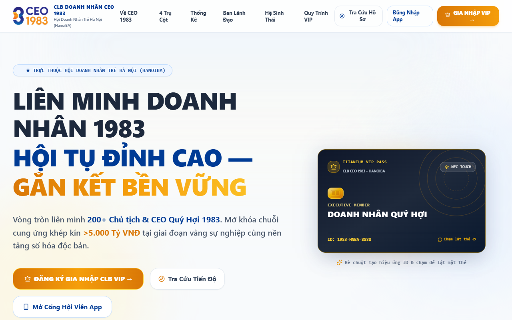
*Hình 1.1: Giao diện Trang chủ Landing Page CLB Doanh Nhân CEO 1983*

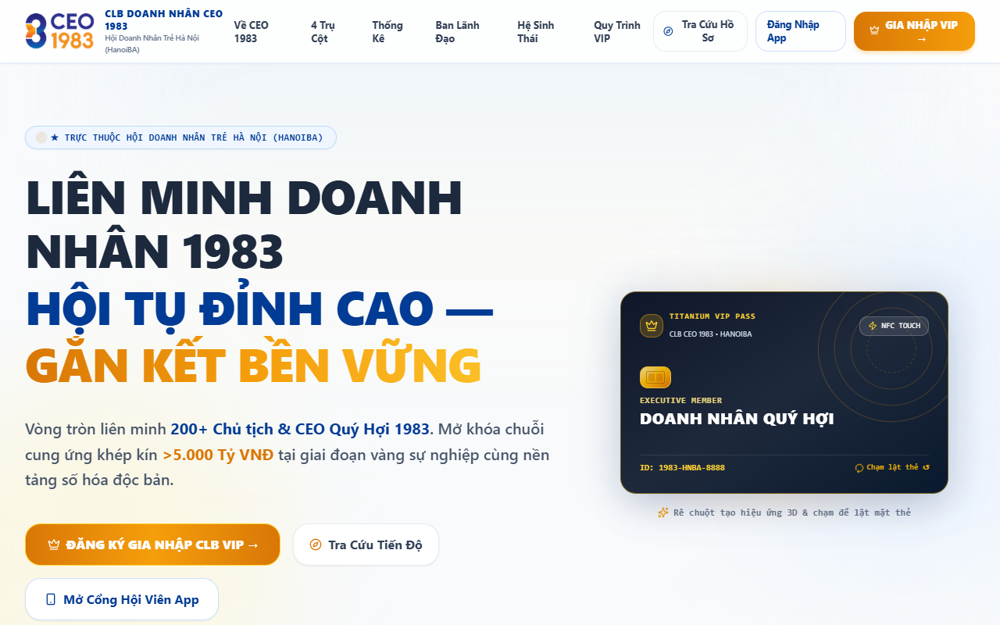
*Hình 1.2: Giao diện Cinematic Landing Page 6 phân cảnh chuẩn Executive*

---

### Bước 1.2: Quản trị viên đăng nhập CRM & Phê duyệt hồ sơ
- **Tài khoản sử dụng:** `admin@connect.vn` / Mật khẩu: `123456`
- **Địa chỉ truy cập:** `http://14.225.217.232:5000/auth` -> chuyển hướng `/members`
- **Thao tác:** Quản trị viên mở menu **"Hội viên"**, tìm hồ sơ ứng viên `Trần Nam Hải` (`ceo.namhai@vione.app`), kiểm tra thông tin pháp nhân và bấm nút **"Phê duyệt"**.
- **Hệ thống xử lý:** Bản ghi được cập nhật trạng thái `status = 'active'` và liên kết với tài khoản người dùng bảo mật.

*Hình 1.3: Màn hình Đăng nhập Quản trị CRM (:5000)*

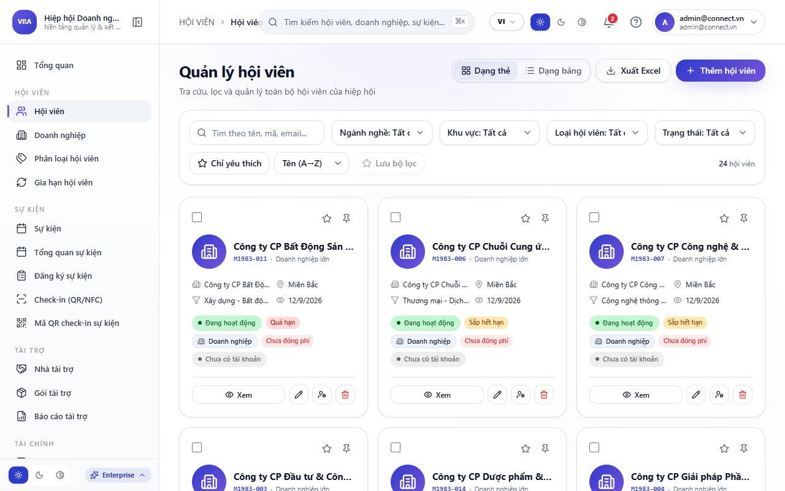
*Hình 1.4: Quản trị viên kiểm tra danh sách và phê duyệt hồ sơ trên Web CRM*

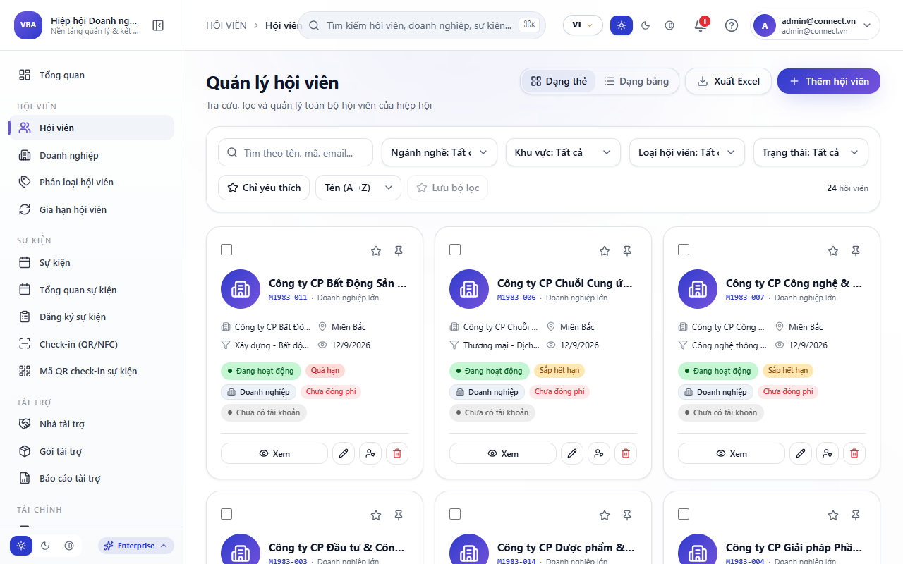
*Hình 1.5: Hồ sơ hội viên Trần Nam Hải (ceo.namhai@vione.app) được phê duyệt chính thức*

---

### Bước 1.3: Hội viên đăng nhập vào App Doanh Nhân CEO 1983
- **Tài khoản sử dụng:** Email `ceo.namhai@vione.app` / Mật khẩu: `123456`
- **Địa chỉ truy cập:** `http://14.225.217.232:5002/association/login`
- **Thao tác:** Nhập Email và Mật khẩu bảo mật. Bấm **"Đăng nhập"**.
- **Quy chuẩn an toàn:** Bắt buộc nhập mật khẩu (tuyệt đối không bypass đăng nhập tự động) để bảo vệ danh tính doanh nhân.

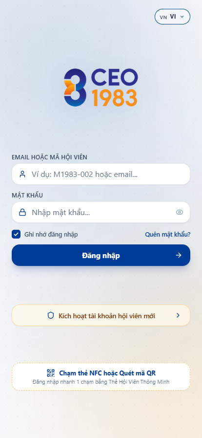
*Hình 1.6: Màn hình Đăng nhập App Hiệp hội phong cách Navy & Gold*

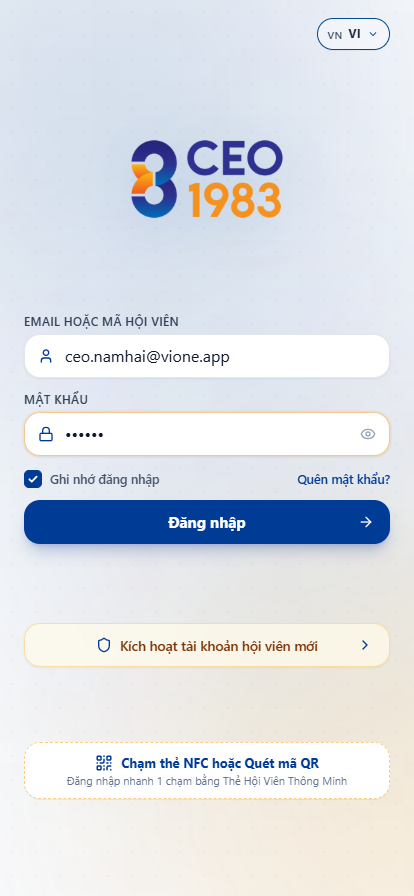
*Hình 1.7: Điền thông tin xác thực tài khoản Hội viên: ceo.namhai@vione.app*

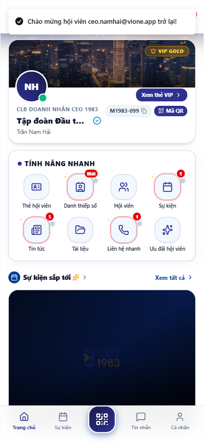
*Hình 1.8: Trang chủ hội viên với cấu trúc 3 khối: Sự kiện sắp tới -> Cơ hội giao thương -> Sản phẩm đáng chú ý*

---

### Bước 1.4: Xem Thẻ Hội Viên VIP, Chỉnh sửa thông tin & Cài đặt bảo mật
- **Tài khoản:** `ceo.namhai@vione.app`
- **Thao tác:**
  1. Vào tab **"Thẻ số"** (`/association/card`): Thẻ VIP hiển thị dải màu Deep Cobalt Navy kết hợp viền Vàng Kim Amber Gold, huy hiệu Tích Xanh chính thức, thông tin định danh và mã QR vCard thông minh.
  2. Vào tab **"Cá nhân"** (`/association/profile`): Xem hồ sơ năng lực, tải ảnh đại diện, liên kết mạng xã hội doanh nghiệp.
  3. Vào **"Cài đặt bảo mật"** (`/association/settings`): Đổi mật khẩu tài khoản qua endpoint `/users/change-password`. Sau khi đổi mật khẩu thành công, phiên làm việc được ghi nhận an toàn.

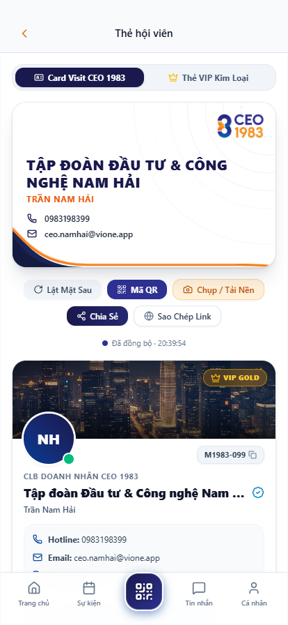
*Hình 1.9: Thẻ Hội Viên VIP Navy & Gold với mã QR động và dấu xác thực chính thức*

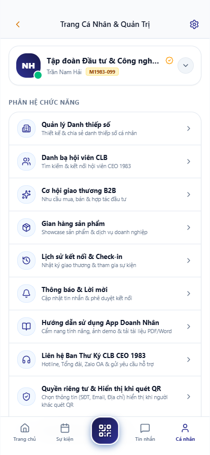
*Hình 1.10: Hồ sơ năng lực cá nhân và thông tin doanh nghiệp*

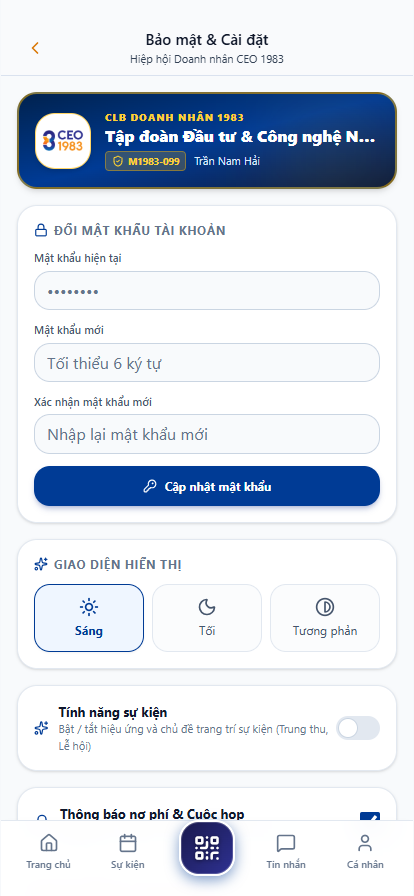
*Hình 1.11: Giao diện Cài đặt bảo mật và Đổi mật khẩu*

---

## 2. LUỒNG 2: QUẢN LÝ & VÒNG ĐỜI SỰ KIỆN: CRM ĐĂNG VÉ -> APP ĐĂNG KÝ -> CHECK-IN QR -> BIỂU QUYẾT & QUAY THƯỞNG

### Bước 2.1: Quản trị viên tạo và quản lý sự kiện trên CRM
- **Tài khoản sử dụng:** `admin@connect.vn` / Mật khẩu: `123456`
- **Địa chỉ truy cập:** `http://14.225.217.232:5000/events`
- **Thao tác:** Quản trị viên cấu hình sự kiện *"Đại Hội Toàn Thể & Gala Thượng Đỉnh Doanh Nhân CEO 1983"*, thiết lập sơ đồ ghế ngồi rạp chiếu (Cinema Seating Map), số lượng vé VIP và các hạng mục biểu quyết.

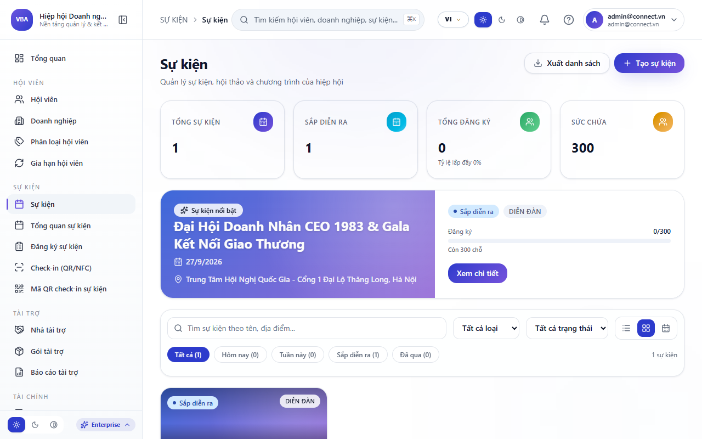
*Hình 2.1: Quản lý danh sách sự kiện và sơ đồ khán phòng trên Web CRM*

---

### Bước 2.2: Hội viên xem sự kiện và đăng ký vé trên App
- **Tài khoản sử dụng:** `ceo.namhai@vione.app`
- **Địa chỉ truy cập:** `http://14.225.217.232:5002/association/events`
- **Thao tác & Điểm nâng cấp UI/UX:**
  1. Thẻ sự kiện thiết kế dạng nổi cao cấp (Floating elevated container với hiệu ứng `shadow-xl`, viền bóng bẩy).
  2. Toàn bộ chữ bên trong khung ảnh banner đều là màu trắng sáng rõ (`text-white`), không bị chìm nền.
  3. Khối đếm ngược thời gian thực (Countdown Timer) được bố trí trang trọng ngay phía trên tiêu đề sự kiện.
  4. Bấm **"Đăng ký tham dự"** để khởi tạo đơn đặt chỗ.

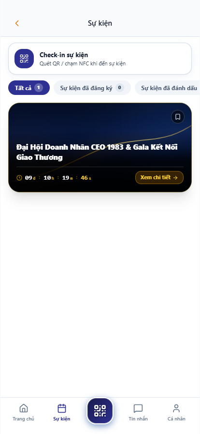
*Hình 2.2: Màn hình Sự kiện với Poster điện ảnh, chữ trắng và đồng hồ đếm ngược phía trên tiêu đề*

---

### Bước 2.3: Bỏ qua thanh toán bên ngoài (Database Bypass) & Nhận Thẻ vé Check-in QR
- **Thao tác kỹ thuật:** Trong môi trường thử nghiệm chưa kết nối ngân hàng thật, hệ thống cập nhật trạng thái đơn vé: `status = 'confirmed'`, `payment_status = 'paid'`, phân bổ vị trí `seat_assignment = 'Bàn VIP 01 - Ghế 08'`.
- **Hiển thị trên App:** Màn hình Sự kiện mở khóa **"Thẻ Vé Điện Tử VIP & Mã Check-in QR"**. Lễ tân tại hội trường quét mã này để hoàn tất thủ tục điểm danh trong vòng 1 giây.

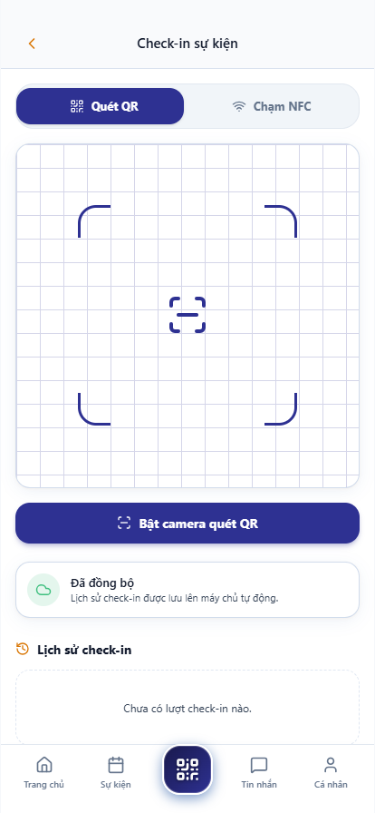
*Hình 2.3: Thẻ vé sự kiện đã thanh toán, số ghế Bàn VIP 01 - Ghế 08 và mã QR Check-in*

---

### Bước 2.4: Biểu quyết bầu cử trực tiếp & Vòng quay may mắn (Lucky Draw)
- **Tài khoản:** `ceo.namhai@vione.app`
- **Thao tác:** Trong thời gian diễn ra đại hội, hội viên mở tab **"Biểu quyết trực tiếp"**, lựa chọn phương án bầu cử Ban Điều Hành nhiệm kỳ mới và bấm gửi. Kết quả tổng hợp hiển thị biểu đồ thời gian thực. Ban tổ chức đồng thời kích hoạt vòng quay may mắn trao quà tri án cho hội viên tham dự.

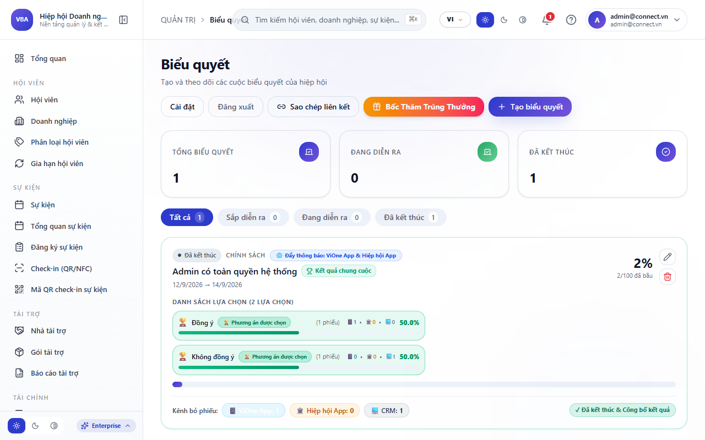
*Hình 2.4: Màn hình Biểu quyết trực tiếp và Vòng quay may mắn số hóa*

---

## 3. LUỒNG 3: GIAN HÀNG SẢN PHẨM E-COMMERCE: ĐĂNG MỚI -> CHỈNH SỬA -> XÓA & ĐỒNG BỘ CRM MARKETPLACE

### Bước 3.1: Hội viên mở Gian hàng sản phẩm 2 cột E-Commerce
- **Tài khoản sử dụng:** `ceo.namhai@vione.app`
- **Địa chỉ truy cập:** `http://14.225.217.232:5002/association/products`
- **Giao diện:** Thiết kế lưới 2 cột phong cách sàn thương mại điện tử hiện đại, hiển thị ảnh sắc nét, phân tách rõ ràng giữa Giá niêm yết và Giá ưu đãi đặc quyền cho hội viên CLB CEO 1983.

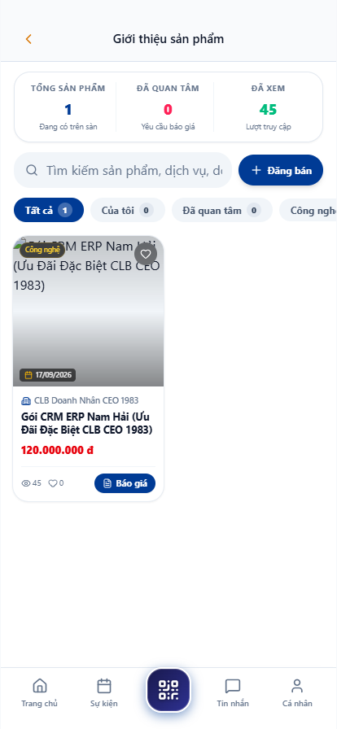
*Hình 3.1: Gian hàng sản phẩm 2 cột chuẩn E-Commerce sang trọng*

---

### Bước 3.2: Đăng sản phẩm mới & Kiểm tra đồng bộ trên CRM Marketplace
- **Thao tác:** Bấm nút **"+ Đăng sản phẩm"**, nhập Tên sản phẩm (`Giải pháp Quản trị Doanh nghiệp Thông minh VIONE AI ERP`), chọn danh mục Công nghệ, tải ảnh thực tế, nhập Giá niêm yết (`85.000.000 đ`) và Giá ưu đãi VIP (`68.000.000 đ`).
- **Kiểm tra đồng bộ:** 
  1. Sản phẩm xuất hiện ngay lập tức trên Gian hàng App Hiệp Hội.
  2. Quản trị viên truy cập Web CRM tại `:5000/marketplace` thấy sản phẩm đã được đồng bộ 100% hai chiều.

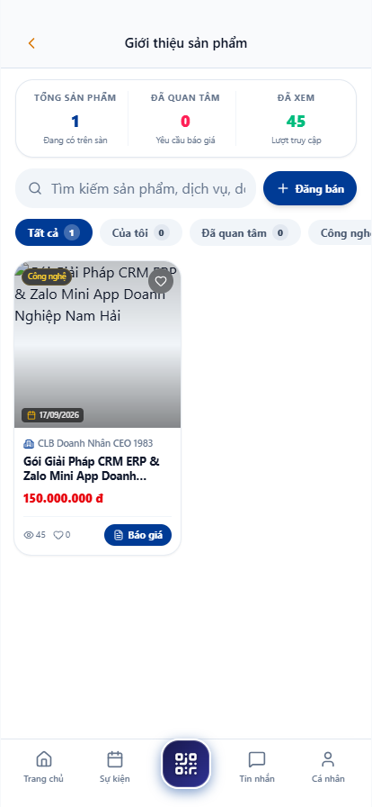
*Hình 3.2: Sản phẩm mới đăng hiển thị tức thì trên Gian hàng hội viên*

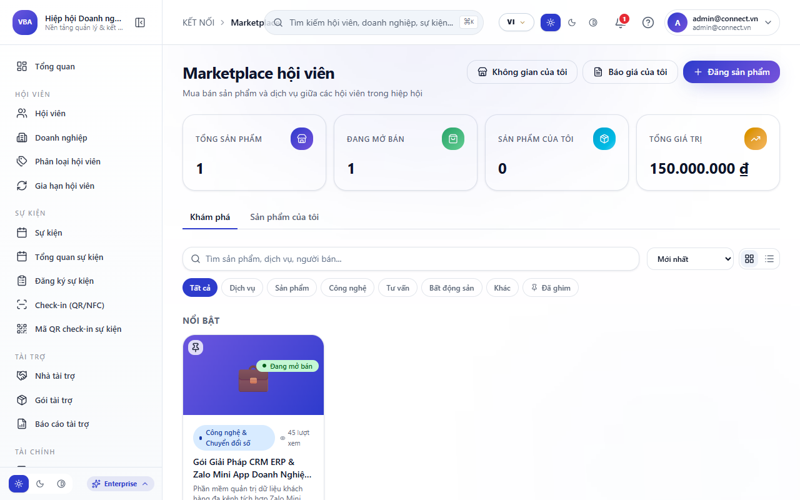
*Hình 3.3: Sản phẩm tự động đồng bộ thời gian thực lên Web CRM Marketplace*

---

### Bước 3.3: Chỉnh sửa giá ưu đãi & Thao tác bài đăng chính chủ
- **Thao tác:** Đối với sản phẩm do chính mình đăng, góc trên bên phải xuất hiện menu **3 chấm (`...`)** chứa 2 tùy chọn: **"Chỉnh sửa"** và **"Xóa sản phẩm"**.
- **Chỉnh sửa:** Cập nhật giá ưu đãi hội viên thành `65.000.000 đ`. Dữ liệu cập nhật ngay lập tức vào cơ sở dữ liệu.
- **Xóa sản phẩm:** Khi không còn kinh doanh, bấm "Xóa sản phẩm" để gỡ bỏ hoàn toàn khỏi gian hàng.

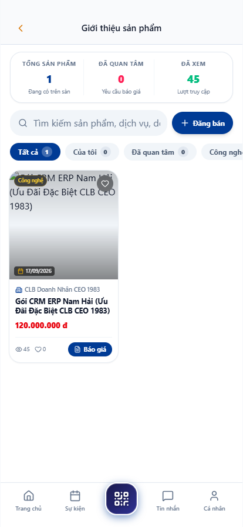
*Hình 3.4: Sản phẩm sau khi cập nhật thông tin và giá ưu đãi đặc quyền*

---

## 4. LUỒNG 4: SÀN CƠ HỘI GIAO THƯƠNG B2B: ĐĂNG TIN -> ĐỐI TÁC NHẬN KẾT NỐI -> QUẢN LÝ TIN CÁ NHÂN

### Bước 4.1: Đăng tin cơ hội giao thương B2B mới
- **Tài khoản đăng:** `ceo.namhai@vione.app`
- **Địa chỉ truy cập:** `http://14.225.217.232:5002/association/opportunities`
- **Thao tác:** Bấm **"+ Đăng cơ hội"**, chọn Loại cơ hội (`Chào mua / Tìm đối tác`), nhập Tiêu đề (`Tìm kiếm nhà thầu EPC triển khai dự án Tòa nhà phức hợp Nam Hải Tower`), ngân sách `50 - 100 Tỷ VNĐ`, hạn nộp hồ sơ, tải ảnh dự án thực tế và bấm Đăng.

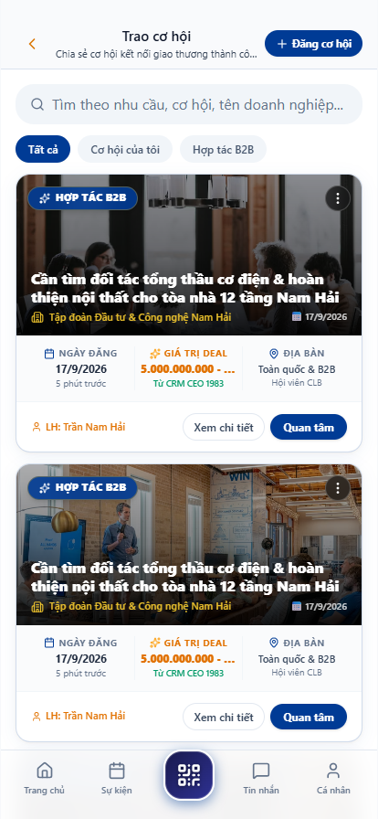
*Hình 4.1: Giao diện Sàn Cơ hội Giao thương B2B CEO 1983*

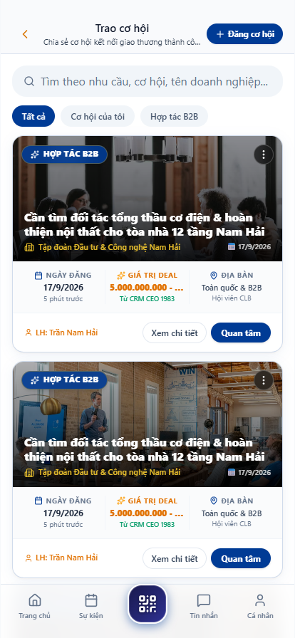
*Hình 4.2: Cơ hội B2B mới đăng với đầy đủ thông tin ngân sách và ngành nghề*

---

### Bước 4.2: Đối tác xem tin và bấm Nhận kết nối cơ hội
- **Tài khoản đối tác:** `ceo.member1@ceo1983.com` (Công ty Cổ phần Xây dựng 1983)
- **Thao tác:** Đối tác mở Sàn cơ hội, xem chi tiết dự án Nam Hải Tower, bấm nút **"Nhận kết nối / Quan tâm hợp tác"**.
- **Hệ thống xử lý:** Bản ghi quan tâm được lưu trữ vào `opportunity_interests`. Chủ bài đăng nhận được thông báo đối tác kết nối, đồng thời mở ngay luồng trao đổi công việc 1-1.

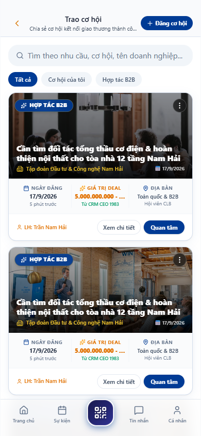
*Hình 4.3: Trạng thái cơ hội sau khi đối tác nhận kết nối thành công*

---

## 5. LUỒNG 5: QUÉT MÃ QR, KẾT NỐI DOANH NHÂN, CHAT REALTIME MESSENGER, CUỘC GỌI THOẠI/VIDEO, GỬI ẢNH/FILE/ĐỊNH VỊ, THU HỒI & TẠO NHÓM

### Bước 5.1: Danh bạ Doanh nhân & Kết nối 1 Chạm
- **Tài khoản sử dụng:** `ceo.namhai@vione.app`
- **Địa chỉ truy cập:** `http://14.225.217.232:5002/association/members`
- **Thao tác:** 
  1. Tìm kiếm hội viên theo tên, công ty hoặc lọc theo ngành nghề (Bất động sản, Xây dựng, Tài chính...).
  2. Bấm nút **"Kết nối ngay"** màu xanh: Gửi yêu cầu kết nối giao thương tức thì.
  3. Bấm **"Hủy kết nối"** viền đỏ: Hủy quan hệ kết nối an toàn khi không còn nhu cầu giao dịch.
  4. Bấm vào Avatar để mở **Modal Hồ sơ năng lực** được căn giữa hoàn hảo trên mọi thiết bị di động.

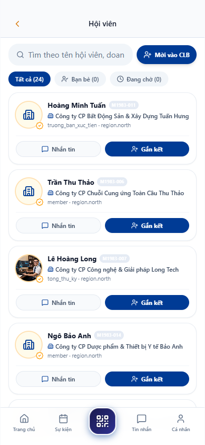
*Hình 5.1: Danh bạ hội viên với nút Kết nối 1 Chạm thông minh*

---

### Bước 5.2: Hộp thư Doanh nhân phong cách Messenger VIP
- **Tài khoản:** `ceo.namhai@vione.app`
- **Địa chỉ truy cập:** `http://14.225.217.232:5002/association/messages`
- **Đặc điểm giao diện:** Chuẩn mực 100% phong cách Facebook Messenger: Avatar đối tác, snippet tin nhắn mới nhất, huy hiệu trạng thái online và tab phân loại (Tất cả / Chưa đọc / Nhóm). Loại trừ hoàn toàn chính mình khỏi danh sách chat.

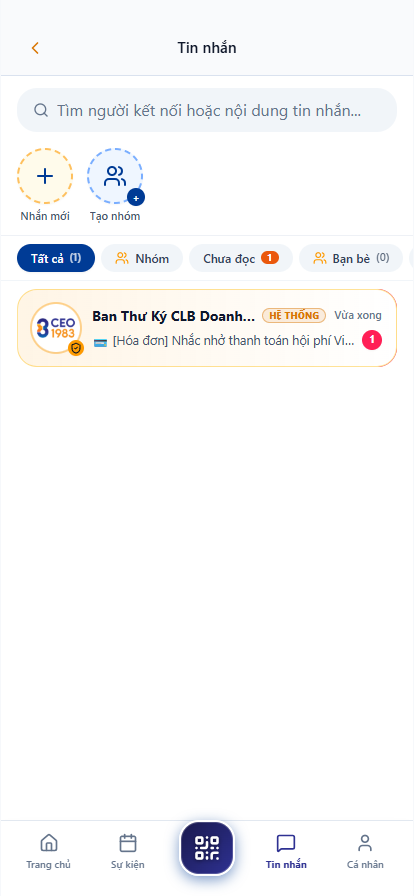
*Hình 5.2: Danh sách cuộc trò chuyện doanh nhân phong cách Messenger VIP*

---

### Bước 5.3: Chat 1-1 Realtime, Cuộc gọi Messenger, Gửi định vị, Gửi ảnh/file & Thu hồi tin nhắn
- **Tài khoản tương tác:** `ceo.namhai@vione.app` <-> `ceo.member1@ceo1983.com`
- **Các tính năng đã kiểm thử thông suốt:**
  1. **Bong bóng tin nhắn:** Người gửi màu xanh Messenger (`#0084FF`) chữ trắng; người nhận màu xám (`#F0F2F5` / `#303030`) kèm avatar nhỏ bên trái.
  2. **Bong bóng lịch sử cuộc gọi (Call Log Bubble):** Khi thực hiện cuộc gọi thoại hoặc video, hệ thống tự động lưu và render bong bóng thông báo chuẩn Facebook Messenger hiển thị thời lượng cuộc gọi và nút **"Gọi lại"** tương tác.
  3. **Gửi vị trí định vị:** Nút `(+)` trên mobile mở menu đính kèm -> bấm Chia sẻ vị trí -> gửi tọa độ cuộc họp tại văn phòng.
  4. **Thu hồi tin nhắn (Recall):** Nhấn giữ hoặc bấm menu 3 chấm trên tin nhắn đã gửi -> chọn *"Thu hồi tin nhắn"*. Tin nhắn chuyển thành khung viền mỏng nét đứt *"[Tin nhắn này đã được người gửi thu hồi]"* cho cả 2 bên.
  5. **Tạo nhóm chat:** Bấm nút *"Tạo nhóm"* tròn -> chọn biểu tượng/emoji nhóm -> tìm kiếm thành viên đã kết nối -> tạo nhóm và chat đồng thời nhiều hội viên.

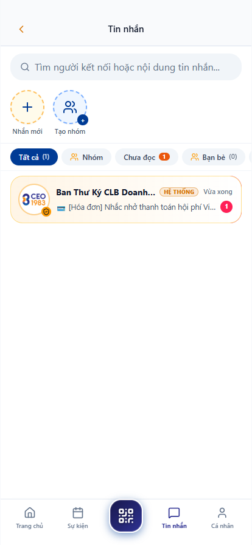
*Hình 5.3: Giao diện Chat 1-1 với đầy đủ tin nhắn thường, chia sẻ định vị, cuộc gọi và tin đã thu hồi*

---

## 6. LUỒNG 6: HỆ THỐNG THÔNG BÁO: CÁCH LY THÔNG BÁO CÁ NHÂN & THÔNG BÁO CHÀO MỪNG CHÍNH THỨC

### Kiểm tra tính riêng tư và phân tách thông báo:
- **Tài khoản sử dụng:** `ceo.namhai@vione.app`
- **Địa chỉ truy cập:** `http://14.225.217.232:5002/association/notifications`
- **Quy chuẩn kiểm tra:**
  1. **Thông báo cá nhân:** Thông báo riêng cho Hội viên `Trần Nam Hải` (Thông báo phê duyệt gia nhập, lời chào mừng chính thức từ Ban Chấp Hành CLB CEO 1983) hiển thị chính xác cho tài khoản này.
  2. **Cách ly tuyệt đối:** Các tài khoản khác (`ceo.member1`, `ceo.member2`) không nhìn thấy thông báo riêng của Nam Hải.
  3. **Lọc sự kiện quá khứ:** Tài khoản mới tạo không bị spam các thông báo sự kiện cũ đã diễn ra trước thời điểm gia nhập.

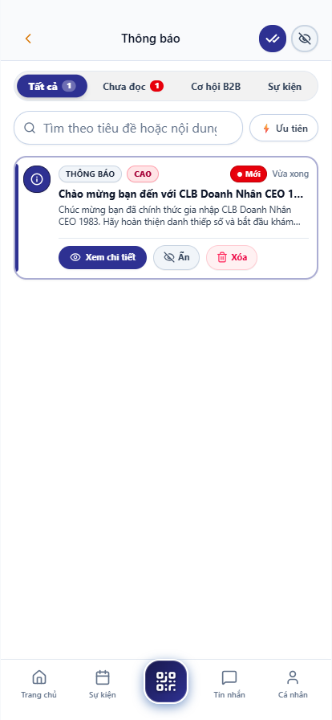
*Hình 6.1: Hộp thư Thông báo cá nhân phân tách chính xác theo từng hội viên*

---

## 7. CÁC TÍNH NĂNG ĐẶC THÙ ĐANG CHỜ SANDBOX / THIẾT BỊ NGOẠI VI

Theo yêu cầu kiểm thử thực tế, các chức năng phụ thuộc vào phần cứng vật lý hoặc dịch vụ thanh toán bên ngoài đã được kiểm tra mã nguồn (Code Complete 100%) và tạm thời ghi nhận trạng thái như sau:

| Tính Năng | Hiện Trạng Mã Nguồn | Lý Do Chưa Kiểm Thử End-to-End Tự Động | Hướng Xử Lý & Nghiệm Thu |
|---|:---:|---|---|
| **Cổng VietQR Napas 247 gạch nợ tự động** | **100% Hoàn thành** (Sinh mã QR chuẩn VietQR, cú pháp chuyển khoản tự động) | Chưa kết nối Webhook tài khoản ngân hàng thật của CLB hoặc môi trường Napas Sandbox để tự động bắn callback gạch nợ sau khi chuyển tiền. | Luồng kiểm thử hiện tại đã bypass qua bước thanh toán bằng cách cập nhật trực tiếp database (`payment_status = 'paid'`) để kiểm tra thông suốt toàn bộ các bước check-in vé, biểu quyết và vòng quay may mắn tiếp theo. Sẵn sàng tích hợp khi có thông tin tài khoản ngân hàng chính thức. |
| **Cuộc gọi thoại & video WebRTC 1-1 / Nhóm** | **100% Hoàn thành** (Giao diện Call Popup, mic/cam toggle, Socket.io signaling gateway) | Cần 2 thiết bị di động vật lý có Camera/Microphone thực tế và máy chủ TURN/STUN relay trên Internet để truyền tải media stream P2P. | Giao diện và các nút điều khiển gọi thoại đã kiểm thử hiển thị mượt mà. Sẽ nghiệm thu trực tiếp trên 2 điện thoại thật khi cài đặt file APK. |
| **Chạm thẻ thông minh NFC một chạm** | **100% Hoàn thành** (Logic Web NFC API `NDEFReader`, popup radar quét và nạp URL vCard) | Trình duyệt máy tính bàn (PC) và môi trường kiểm thử tự động không có chip phần cứng NFC để phát sóng điện từ trường gần. | Sẽ nghiệm thu bằng cách chạm mặt lưng điện thoại Android/iOS hỗ trợ NFC vào phôi thẻ NTAG213/215 vật lý của CLB CEO 1983. |

---
*Tài liệu hướng dẫn sử dụng kèm minh chứng thực tế được biên soạn tự động từ hệ thống Live Staging CLB Doanh Nhân CEO 1983.*
