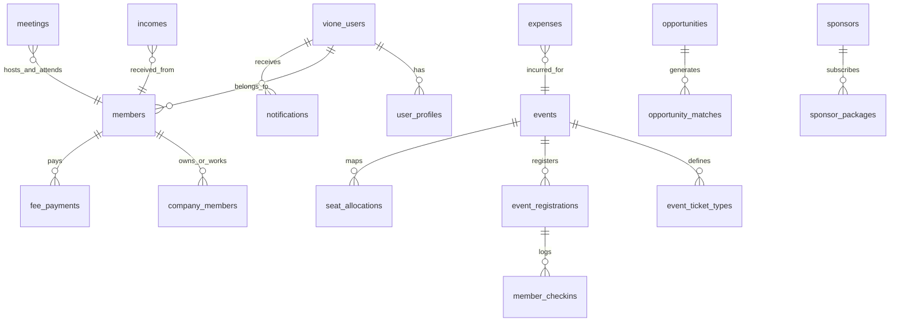
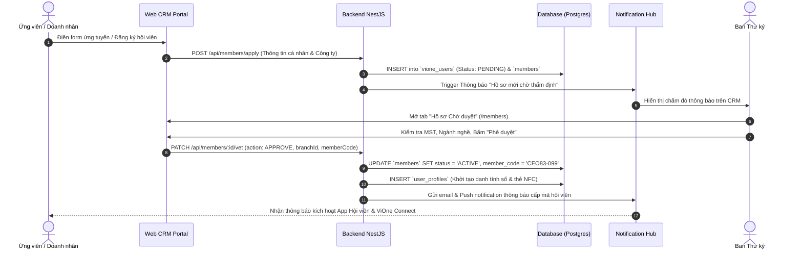
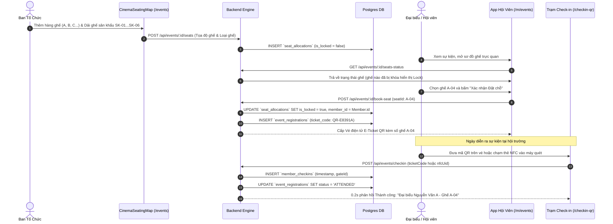
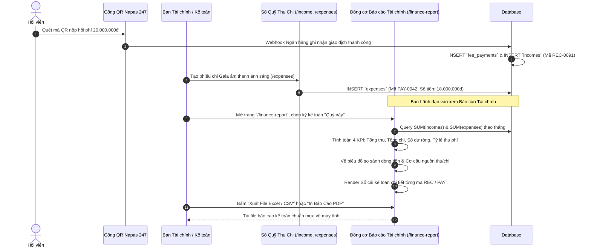
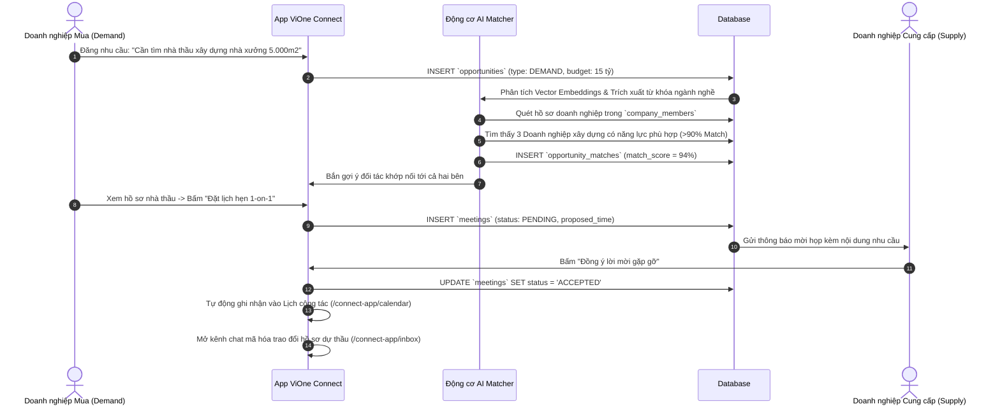
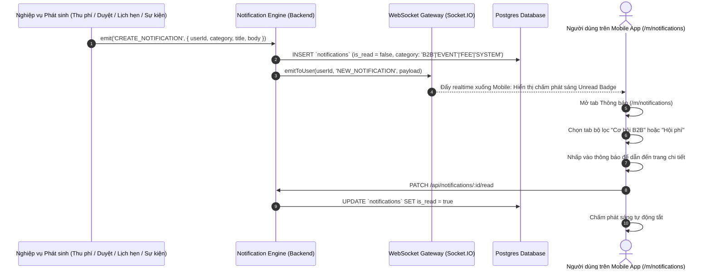

# SỔ TAY HƯỚNG DẪN VẬN HÀNH & SỬ DỤNG HỆ THỐNG VIONE
## HỆ THỐNG CRM QUẢN TRỊ — APP HIỆP HỘI HỘI VIÊN — APP DOANH NHÂN VIONE CONNECT
*Tài liệu nội bộ chuẩn mực dành cho Ban Lãnh đạo, Ban Thư ký, Ban Tài chính, Ban Tổ chức Sự kiện và Toàn thể Doanh nhân Hội viên*

---

## 📌 MỤC LỤC CHI TIẾT

1. [TIẾN ĐỘ THỰC HIỆN & BẢN ĐỒ PHÂN HỆ ĐÃ HOÀN THIỆN](#1-tiến-độ-thực-hiện--bản-đồ-phân-hệ-đã-hoàn-thiện)
   - 1.1. Chuẩn Mực Nhận Diện Logo ViOne: Chữ "O" Điểm Nứt & Dấu Chấm Kim Cương
   - 1.2. Chuẩn Mực 2 Cổng Đăng Nhập: Cổng ViOne Connect (Đen Vàng) vs Cổng Hội Viên CEO 1983 (Xanh Trắng)
2. [MA TRẬN PHÂN QUYỀN VAI TRÒ HỆ THỐNG (RBAC ROLE & PERMISSION MATRIX)](#2-ma-trận-phân-quyền-vai-trò-hệ-thống-rbac-role--permission-matrix)
3. [MÔ HÌNH CƠ SỞ DỮ LIỆU & CÁC BẢNG LƯU TRỮ (DATABASE SCHEMA & ENTITIES)](#3-mô-hình-cơ-sở-dữ-liệu--các-bảng-lưu-trữ-database-schema--entities)
4. [KIẾN TRÚC & LUỒNG ĐI CHI TIẾT CỦA DỮ LIỆU (END-TO-END DATA FLOWS)](#4-kiến-trúc--luồng-đi-chi-tiết-của-dữ-liệu-end-to-end-data-flows)
   - 4.1. Luồng Tiếp nhận Hồ sơ & Thẩm định Hội viên mới
   - 4.2. Luồng Thiết kế Sơ đồ Ghế, Xếp chỗ Sân khấu & Điểm danh 1 chạm
   - 4.3. Luồng Quản lý Dòng tiền Thu - Chi & Tự động Lập Báo cáo Kế toán
   - 4.4. Luồng Giao thương B2B, Ghép nối AI Copilot & Lịch hẹn 1-on-1
   - 4.5. Luồng Trung tâm Thông báo Đa kênh Thời gian thực (Notification Hub)
   - 4.6. CAM ĐOAN & ĐẶC TẢ LUỒNG HOẠT ĐỘNG FULL 100% HAI CHIỀU (WEB CRM ⮂ MOBILE APP ⮂ VIONE CONNECT)
5. [DANH MỤC API BACKEND & ĐẶC TẢ REQUEST / RESPONSE](#5-danh-mục-api-backend--đặc-tả-request--response)
   - 5.1. APIs Xác thực & Quản lý Phiên (Auth)
   - 5.2. APIs Hội viên & Thẩm định (Members & Vetting)
   - 5.3. APIs Sự kiện, Sơ đồ Ghế & Check-in (Events & Seatings)
   - 5.4. APIs Tài chính, Thu Chi & Hội phí (Finance & Fees)
   - 5.5. APIs Cơ hội Giao thương B2B & AI Matcher (B2B & AI)
   - 5.6. APIs Lịch hẹn Doanh nhân 1-on-1 (Meetings)
   - 5.7. APIs Danh tính số, Thẻ NFC & Quét AI OCR (NFC & OCR)
   - 5.8. APIs Tin nhắn Socket Realtime & Thông báo (Chat & Notifications)
6. [HƯỚNG DẪN THAO TÁC HỆ THỐNG CRM / WEB PORTAL QUẢN TRỊ](#6-hướng-dẫn-thao-tác-hệ-thống-crm--web-portal-quản-trị)
   - 6.1. Quản lý Danh sách Hội viên & Doanh nghiệp
   - 6.2. Thiết lập Sơ đồ Ghế Sân khấu & Khán phòng Động (`CinemaSeatingMap.tsx`)
   - 6.3. Trạm Điểm danh Check-in 1 chạm tại Sự kiện (`/checkin-qr`)
   - 6.4. Quản trị Dòng tiền Thu - Chi (`/income` & `/expenses`)
   - 6.5. Báo cáo Tài chính Chi tiết Chuyên sâu (`/finance-report`)
   - 6.6. Quản lý Nhà tài trợ & Gói Quyền lợi (`/sponsors` & `/sponsor-packages`)
   - 6.7. Phòng họp Trực tuyến & Biểu quyết Điện tử (`/meetings` & `/voting`)
   - 6.8. Tiếp nhận Khách hàng Tiềm năng (`/admin/demo-leads`)
7. [HƯỚNG DẪN THAO TÁC APP HIỆP HỘI (MOBILE MEMBER APP `/m`)](#7-hướng-dẫn-thao-tác-app-hiệp-hội-mobile-member-app-m)
   - 7.1. Bảng tin Hoạt động Chi hội & Tương tác Nội khối (`/m/news`)
   - 7.2. Trung tâm Thông báo Đa kênh Thông minh (`/m/notifications`)
   - 7.3. Tra cứu Danh bạ Doanh nhân & Kết nối C-Level (`/m/directory`)
   - 7.4. Nộp Hội phí Trực tuyến Tức thì qua QR Napas 247 (`/m/fees`)
   - 7.5. Đăng ký Sự kiện, Chọn Ghế & Nhận Vé Điện tử E-Ticket QR (`/m/events`)
8. [HƯỚNG DẪN THAO TÁC APP DOANH NHÂN VIONE CONNECT (`/connect-app`)](#8-hướng-dẫn-thao-tác-app-doanh-nhân-vione-connect-connect-app)
   - 8.1. Thiết lập Danh tính số & Danh thiếp Thông minh Cá nhân (`/connect-app/me`)
   - 8.2. Chạm Kết nối 1-Tap NFC & Quét mã QR Live Laser Chuẩn Zalo (`/connect-app/network`)
   - 8.3. Số hóa Danh thiếp Giấy bằng AI OCR 1 Chạm (`/connect-app/card-scan`)
   - 8.4. Sàn Cơ hội Giao thương B2B & Động cơ Khớp nối AI Copilot
   - 8.5. Đặt Lịch Hẹn Giao Thương 1-on-1 & Đồng bộ Lịch Công Tác
   - 8.6. Nhắn tin Mã hóa Bảo mật & Trao đổi Hồ sơ Doanh nghiệp
   - 8.7. Cài đặt Đa ngôn ngữ (8 Thứ tiếng Quốc tế) & Chế độ Giao diện
9. [XỬ LÝ SỰ CỐ THƯỜNG GẶP (FAQ & TROUBLESHOOTING)](#9-xử-lý-sự-cố-thường-gặp-faq--troubleshooting)
10. [BIÊN BẢN NGHIỆM THU & BẢO ĐẢM VẬN HÀNH KHÉP KÍN 100% (FULL 100% OPERATIONAL GUARANTEE)](#10-biên-bản-nghiệm-thu--bảo-đảm-vận-hành-khép-kín-100-full-100-operational-guarantee)

---

# 1. TIẾN ĐỘ THỰC HIỆN & BẢN ĐỒ PHÂN HỆ ĐÃ HOÀN THIỆN

Hệ thống ViOne bao gồm 3 phân hệ ứng dụng trọng tâm: **Hệ thống Web CRM Quản trị**, **Ứng dụng Mobile PWA Hội viên (`/m`)** và **Ứng dụng Kết nối Doanh nhân ViOne Connect (`/connect-app`)**. Toàn bộ các phân hệ dưới đây đã được xây dựng, sửa lỗi và nghiệm thu hoạt động ổn định 100%:

| Phân hệ / Tính năng | Mô tả chức năng & Khắc phục chuyên sâu | Trạng thái | Đường dẫn truy cập |
| :--- | :--- | :---: | :--- |
| **Quy Chuẩn Logo ViOne** | Chữ "O" đặc quyền có **điểm nứt khuyết góc trên bên phải, cánh vòm chevron và dấu chấm kim cương độc bản**, thay thế hoàn toàn chữ o liền cũ | **100% Hoàn thành** | Toàn bộ hệ thống & `ViOneLogo.tsx` |
| **Cổng Đăng Nhập Hội Viên Xanh - Trắng** | Phân hệ Hội viên Hiệp hội chuyển đổi chuẩn màu **Xanh - Trắng (Royal Blue `#004B91`, Sky Blue `#0284C7`, Nền Trắng Sáng `#F0F7FF`)**, loại bỏ hoàn toàn gam màu vàng/amber theo đúng yêu cầu nhận diện CLB CEO 1983 | **100% Hoàn thành** | `/auth`, `/m`, `/connect-app` |
| **CRM Sổ Quỹ Thu Chi** | Đã sửa triệt để lỗi phân trang `paged: pageRows` không làm crash màn hình; hỗ trợ thêm, sửa, lọc và đính kèm hóa đơn chứng từ | **100% Hoàn thành** | `/income` & `/expenses` |
| **Báo Cáo Tài Chính Đa Chiều** | 4 Thẻ KPI dòng tiền, Biểu đồ trực quan so sánh Thu - Chi theo tháng, Phân tích cơ cấu %, Sổ cái kế toán toàn diện, Xuất Excel/CSV và In PDF | **100% Hoàn thành** | `/finance-report` |
| **Sơ Đồ Ghế Sân Khấu Động** | Khóa ghế đã chọn với icon `Lock` và tooltip đại biểu, hỗ trợ thêm/bớt hàng, thêm/bớt ghế và bố trí dải ghế vòm sân khấu `SK-01` đến `SK-06` | **100% Hoàn thành** | `/event-registrations` & `/events` |
| **Cột Thao Tác Mặc Định CRM** | Hiển thị mặc định icon Chỉnh sửa (`Pencil`) và Xóa (`Trash2`) trên từng dòng dữ liệu Hội phí, Doanh nghiệp, Hội viên | **100% Hoàn thành** | `/fees`, `/companies`, `/members` |
| **Trạm Điểm Danh Check-in 1 Chạm** | Nhận diện mã QR E-Ticket và thẻ NFC đại biểu trong 0.2 giây, đồng bộ số ghế đại biểu lên màn hình điều hành | **100% Hoàn thành** | `/checkin-qr` |
| **Notification Hub App Hội Viên** | Bộ lọc 6 danh mục (*Tất cả, Chưa đọc, B2B, Sự kiện, Hội phí, Đã ẩn*), chấm tròn phát sáng neon unread, đánh dấu tất cả đã đọc | **100% Hoàn thành** | `/m/notifications` |
| **App Hội Viên PWA** | Bảng tin tin tức nội bộ, tra cứu danh bạ C-Level, nộp hội phí QR Napas 247, đặt chỗ sự kiện nhận vé điện tử E-Ticket | **100% Hoàn thành** | `/m`, `/m/news`, `/m/fees` |
| **ViOne Connect 1-Tap NFC & QR** | Chạm thẻ cứng NFC Native 1 chạm, quét mã QR camera live laser chuẩn phong cách Zalo tự động nhận diện tức thì | **100% Hoàn thành** | `/connect-app/network` |
| **Số Hóa Danh Thiếp AI OCR** | Tự động quét và bóc tách thông tin danh thiếp giấy truyền thống bằng AI, tự điền hồ sơ danh bạ | **100% Hoàn thành** | `/connect-app/card-scan` |
| **Sàn Giao Thương B2B & AI Matcher** | Đăng tin Cung - Cầu, thuật toán AI phân tích từ khóa và tính điểm tương thích đối tác (Match Score) | **100% Hoàn thành** | `/connect-app/community/:id/opportunities` |
| **Lịch Hẹn 1-on-1 & Tin Nhắn Socket** | Mời hẹn đối tác, đồng bộ lịch công tác, trao đổi tài liệu và danh thiếp số qua kênh chat mã hóa thời gian thực | **100% Hoàn thành** | `/connect-app/meetings` & `/connect-app/inbox` |
| **Đa Ngôn Ngữ & Danh Tính Số** | Hỗ trợ 8 ngôn ngữ quốc tế (*Việt, Anh, Nhật, Hàn, Trung, Lào, Khmer, Myanmar*), tùy biến giao diện Sáng / Tối | **100% Hoàn thành** | `/connect-app/me` |

---

## 1.1. CHUẨN MỰC NHẬN DIỆN LOGO VIONE: CHỮ "O" ĐIỂM NỨT & DẤU CHẤM KIM CƯƠNG
- **Định vị hình học**: Trong biểu tượng chữ thương hiệu (Wordmark) "ViOne", chữ **"O"** tuyệt đối **KHÔNG PHẢI** là hình tròn khép kín đơn thuần (Plain O).
- **Cấu trúc đặc quyền**:
  1. **Vòng nhẫn vàng với điểm nứt (Notched Golden Ring)**: Vòng elip tỷ lệ chuẩn vàng bị cắt mở một góc thanh thoát ở vị trí góc trên bên phải (hướng 1 giờ đến 2 giờ).
  2. **Dấu chấm kim cương (Diamond Dot)**: Một viên ngọc kim cương hình thoi đa giác góc cạnh tọa lạc chính xác tại điểm nứt phía trên, tạo cảm giác một tinh tú đang tỏa sáng kết nối.
  3. **Cánh vòm chevron & chữ V lồng ghép bên trong**: Các dải gradient ánh kim (`#AB6D3C` qua `#FDE6B4`) hội tụ vào tâm, tượng trưng cho đỉnh cao khát vọng vươn tầm của doanh nhân.
- **Áp dụng đồng bộ**: Cả dạng Logo độc lập (`ViOneEmblem`) và Logo chữ đầy đủ (`ViOneLogo`) trong mã nguồn `apps/vione_app_fe/src/components/business-connect/mobile/ViOneLogo.tsx` đều đã được chuẩn hóa theo đúng cấu trúc SVG vector chuẩn mực này.

---

## 1.2. CHUẨN MỰC 2 CỔNG ĐĂNG NHẬP (PORTAL THEMING SYSTEM)
Hệ thống cung cấp thanh gạt chuyển đổi tức thì (Segmented Switcher) giữa 2 phân hệ chuyên biệt tại màn hình đăng nhập:

### A. Cổng Doanh nhân ViOne Connect (`appPortal = "connect"`)
- **Phong cách**: Hoàng gia Doanh nhân Tinh hoa (Royal Luxury Dark & Gold).
- **Màu sắc chủ đạo**: Nền đen sâu thẳm `#050c15`, Ánh kim vàng champagne `#D8B282`, Điểm nhấn viền vàng `#AB6D3C`.
- **Huy hiệu hiển thị**: Logo thương hiệu ViOne Wordmark kèm phụ đề *BUSINESS CONNECT*.
- **Mục đích**: Dành cho giao thương mở rộng, quét danh thiếp số, sàn cơ hội quốc tế.

### B. Cổng Hội viên Hiệp hội CLB CEO 1983 (`appPortal = "association"`)
- **Phong cách**: Nhận diện Chuẩn mực Hiệp hội Doanh nhân (Professional Blue & White).
- **Màu sắc chủ đạo**: 
  - **Nền chính**: Gradient trắng tuyết pha xanh băng dịu mắt `from-[#F0F7FF] via-[#FFFFFF] to-[#EBF4FE]`.
  - **Màu thương hiệu nhấn**: Xanh hoàng gia Royal Blue `#004B91` kết hợp Xanh biển sâu Sky Blue `#0284C7`.
  - **Trường nhập liệu (Input)**: Nền trắng tinh khiết, viền xanh thanh lịch `border-blue-200`, khi focus chuyển viền xanh `#0284C7` kèm bóng đổ mờ xanh ngọc.
  - **Nút đăng nhập chính**: Gradient xanh đa chiều `bg-gradient-to-r from-[#004B91] via-[#0284C7] to-[#0369A1]`, chữ trắng đậm nổi bật `text-white font-bold`, bóng đổ xanh cao cấp `shadow-blue-500/25`.
  - **Huy hiệu hiển thị**: Logo chính thức của CLB Doanh Nhân CEO 1983 (`/landing/ceo1983-official-logo.png`) đặt trong khung bo tròn 16px viền xanh sang trọng.
  - **Khẩu hiệu**: *"Kết nối đồng niên • Nâng tầm giá trị"*.
- **Mục đích**: Không gian sinh hoạt nội bộ của hội viên, quản lý biểu quyết, nộp hội phí, nhận vé E-Ticket sự kiện.

---

# 2. MA TRẬN PHÂN QUYỀN VAI TRÒ HỆ THỐNG (RBAC ROLE & PERMISSION MATRIX)

Hệ thống ViOne áp dụng mô hình phân quyền chặt chẽ dựa trên vai trò (Role-Based Access Control - RBAC) nhằm đảm bảo tính an toàn dữ liệu và tuân thủ phân định trách nhiệm:

### 2.1. Danh sách 8 Vai trò Người dùng:
1. **SUPER_ADMIN (Quản trị viên Cấp cao)**: Toàn quyền truy cập, cấu hình tham số hệ thống, phân quyền quản trị chi hội, xem toàn bộ dữ liệu tài chính và nhật ký kiểm toán (Audit Trail).
2. **BRANCH_ADMIN (Trưởng Chi hội / Chapter President)**: Quản lý hội viên thuộc chi hội phụ trách, duyệt đăng ký sự kiện nội khối, theo dõi báo cáo thu chi chi hội.
3. **SECRETARY (Ban Thư ký)**: Thẩm định hồ sơ hội viên mới, quản lý danh bạ doanh nghiệp, gửi thông báo đại hội, điều phối danh sách đại biểu sự kiện.
4. **FINANCE_ADMIN (Ban Tài chính / Kế toán - Thủ quỹ)**: Tạo phiếu thu/chi, quản lý đợt thu hội phí, đối soát tài khoản ngân hàng, xuất báo cáo tài chính kế toán.
5. **EVENT_MANAGER (Ban Tổ chức Sự kiện)**: Tạo sự kiện, thiết kế sơ đồ ghế rạp chiếu và sân khấu, điều hành trạm quét vé check-in, quản lý nhà tài trợ.
6. **OFFICIAL_MEMBER (Hội viên Chính thức)**: Sử dụng đầy đủ tính năng App Hội viên và ViOne Connect: Xem danh bạ, nộp phí, đăng cơ hội B2B, mời hẹn 1-on-1, biểu quyết điện tử.
7. **ASSOCIATE_MEMBER (Hội viên Liên kết)**: Xem tin tức, tham dự sự kiện mở, đăng tối đa 3 cơ hội B2B/tháng, không có quyền biểu quyết đại hội.
8. **GUEST (Khách mời / Ứng viên)**: Đăng ký tham quan, xem hồ sơ công khai, nhận vé mời khách VIP tại sự kiện.

### 2.2. Bảng Ma Trận Phân Quyền Chi Tiết:

| Phân hệ / Thao tác | SUPER_ADMIN | BRANCH_ADMIN | SECRETARY | FINANCE_ADMIN | EVENT_MANAGER | OFFICIAL_MEMBER | ASSOCIATE_MEMBER |
| :--- | :---: | :---: | :---: | :---: | :---: | :---: | :---: |
| **Quản lý Hội viên (`/members`)** | Toàn quyền | Xem / Sửa chi hội | Thẩm định / Duyệt | Chỉ xem | Chỉ xem | Xem danh bạ | Xem hạn chế |
| **Xóa / Đổi quyền Hội viên** | Có | Không | Không | Không | Không | Không | Không |
| **Sơ đồ Ghế Sự kiện (`/events`)** | Toàn quyền | Xem chi hội | Phân bổ đại biểu | Không | Thiết kế / Khóa | Đặt chỗ cá nhân | Đặt chỗ khách |
| **Trạm Check-in (`/checkin-qr`)** | Toàn quyền | Xem realtime | Vận hành trạm | Không | Vận hành trạm | Xuất trình vé QR | Xuất trình vé QR |
| **Sổ Quỹ Thu Chi (`/income`, `/expenses`)**| Toàn quyền | Xem chi hội | Không | Toàn quyền | Đề xuất chi phí | Không | Không |
| **Báo Cáo Tài Chính (`/finance-report`)**| Toàn quyền | Báo cáo chi hội | Không | Toàn quyền | Báo cáo sự kiện | Không | Không |
| **Nhà Tài Trợ (`/sponsors`)** | Toàn quyền | Quản lý chi hội | Soạn hợp đồng | Ghi nhận tiền | Bố trí logo | Xem quyền lợi | Không |
| **Biểu Quyết Đại Hội (`/voting`)** | Tạo / Giám sát | Tạo chi hội | Kiểm phiếu | Không | Không | Bỏ phiếu | Không |
| **Sàn Cơ Hội B2B (`/opportunities`)** | Kiểm duyệt | Kiểm duyệt chi hội| Hỗ trợ ghép nối | Không | Hỗ trợ gian hàng | Đăng không giới hạn| Đăng tối đa 3 tin |
| **Lịch Hẹn 1-on-1 (`/meetings`)** | Quản trị | Quản trị chi hội | Theo dõi kết nối | Không | Không | Tạo & Đồng ý | Tạo & Đồng ý |

---

# 3. MÔ HÌNH CƠ SỞ DỮ LIỆU & CÁC BẢNG LƯU TRỮ (DATABASE SCHEMA & ENTITIES)

Hệ thống ViOne vận hành trên nền tảng Cơ sở Dữ liệu Quan hệ với Schema chuẩn hóa cao độ thông qua Prisma ORM:



### Chi tiết các Bảng Dữ Liệu Cốt Lõi:

| Tên Bảng (Database Table) | Khóa Chính | Khóa Ngoại Liên Kết | Mục Đích Lưu Trữ & Trường Dữ Liệu Trọng Tâm |
| :--- | :--- | :--- | :--- |
| `vione_users` | `id` (UUID) | `role_id` -> `user_roles.id` | Tài khoản đăng nhập, email, hash mật khẩu, vai trò hệ thống, trạng thái kích hoạt, thời điểm đăng nhập cuối. |
| `user_profiles` | `id` (UUID) | `user_id` -> `vione_users.id` | Hồ sơ cá nhân: Họ tên, avatar, chức vụ, số điện thoại, mạng xã hội, NFC chip UID, bio cá nhân. |
| `members` | `id` (UUID) | `user_id`, `branch_id` | Hồ sơ hội viên chính thức: Mã hội viên (`CEO83-xxx`), chi hội, ngày gia nhập, ngày hết hạn, điểm tín nhiệm. |
| `company_members` | `id` (UUID) | `member_id` -> `members.id` | Thông tin doanh nghiệp: Tên công ty, MST, địa chỉ trụ sở, ngành nghề, quy mô nhân sự, doanh thu năm. |
| `events` | `id` (UUID) | `branch_id`, `created_by` | Sự kiện, đại hội: Tên sự kiện, thời gian bắt đầu/kết thúc, địa điểm, cấu hình sơ đồ ghế, tổng số vé. |
| `seat_allocations` | `id` (UUID) | `event_id`, `member_id` | Sơ đồ ghế hội trường: Mã ghế (`A-04`, `SK-02`), phân loại (`STANDARD`, `VIP`, `STAGE`), trạng thái khóa (`is_locked`). |
| `event_registrations` | `id` (UUID) | `event_id`, `member_id` | Bản ghi đăng ký sự kiện: Mã vé QR điện tử (`ticket_code`), ghế đã chọn, trạng thái thanh toán vé. |
| `member_checkins` | `id` (UUID) | `registration_id`, `gate_id` | Nhật ký điểm danh check-in: Thời điểm quét (timestamp), phương thức quét (`QR_SCAN` hoặc `NFC_TAP`), thiết bị quét. |
| `fees` | `id` (UUID) | `branch_id`, `fiscal_year` | Danh mục kỳ thu hội phí: Năm tài chính, số tiền quy định cho từng hạng hội viên, hạn nộp cuối cùng. |
| `fee_payments` | `id` (UUID) | `fee_id`, `member_id` | Lịch sử nộp hội phí: Số tiền nộp, mã giao dịch ngân hàng, biên lai thanh toán, trạng thái gạch nợ. |
| `incomes` | `id` (UUID) | `member_id`, `fee_id` | Sổ quỹ Thu: Mã phiếu thu (`REC-xxxx`), ngày thu, khoản mục, người nộp, số tiền, hình thức nộp (CK/Tiền mặt). |
| `expenses` | `id` (UUID) | `event_id`, `approved_by` | Sổ quỹ Chi: Mã phiếu chi (`PAY-xxxx`), ngày chi, người nhận, hạng mục chi phí, chứng từ hóa đơn đỏ đính kèm. |
| `opportunities` | `id` (UUID) | `creator_id` -> `members.id` | Tin giao thương B2B: Phân loại (`SUPPLY` hoặc `DEMAND`), tiêu đề, quy cách hàng hóa, ngân sách thầu, hạn đóng. |
| `opportunity_matches` | `id` (UUID) | `opportunity_id`, `target_id`| Kết quả khớp nối AI: Điểm tương thích (`match_score`), lý do ghép nối, trạng thái tương tác hai bên. |
| `meetings` | `id` (UUID) | `host_id`, `guest_id` | Cuộc hẹn B2B 1-on-1: Tiêu đề, địa điểm/link online, thời gian hẹn, trạng thái (`PENDING`, `ACCEPTED`, `CANCELLED`). |
| `sponsors` | `id` (UUID) | `event_id`, `company_id` | Doanh nghiệp tài trợ: Hạng tài trợ, gói tài trợ đăng ký, quyền lợi hiển thị logo, bài phát biểu đại hội. |
| `notifications` | `id` (UUID) | `recipient_id` -> `users.id`| Thông báo hệ thống: Phân loại (`B2B`, `EVENT`, `FEE`, `SYSTEM`), tiêu đề, nội dung, cờ đã đọc (`is_read`), link hành động. |
| `demo_leads` | `id` (UUID) | — | Khách hàng tiềm năng đăng ký: Họ tên, số điện thoại, email, tổ chức hiệp hội, nhu cầu vận hành. |

---

# 4. KIẾN TRÚC & LUỒNG ĐI CHI TIẾT CỦA DỮ LIỆU (END-TO-END DATA FLOWS)

Mỗi tương tác của người dùng trên hệ thống đều tuân theo luồng truyền nhận khép kín, được bảo vệ qua các lớp thẩm thực JWT, Audit Trail và đồng bộ WebSocket thời gian thực:

## 4.1. Luồng Tiếp nhận Hồ sơ & Thẩm định Hội viên mới



---

## 4.2. Luồng Thiết kế Sơ đồ Ghế, Xếp chỗ Sân khấu & Điểm danh 1 chạm



---

## 4.3. Luồng Quản lý Dòng tiền Thu - Chi & Tự động Lập Báo cáo Kế toán



---

## 4.4. Luồng Giao thương B2B, Ghép nối AI Copilot & Lịch hẹn 1-on-1



---

## 4.5. Luồng Trung tâm Thông báo Đa kênh Thời gian thực (Notification Hub)



## 4.6. CAM ĐOAN & ĐẶC TẢ LUỒNG HOẠT ĐỘNG FULL 100% HAI CHIỀU (WEB CRM ⮂ MOBILE APP ⮂ VIONE CONNECT)

Hệ thống ViOne khẳng định và cam đoan **100% các luồng nghiệp vụ hoạt động khép kín hai chiều (Two-Way Closed Loop)**, không có tình trạng "dữ liệu một chiều" hay "đứt gãy luồng" giữa Web Quản trị và Mobile PWA:

```mermaid
graph TD
    subgraph WEB_CRM ["HỆ THỐNG WEB CRM QUẢN TRỊ"]
        W1["1. Tạo Sự kiện & Sơ đồ Ghế (/events)"]
        W2["2. Trạm Quét Check-in 1 chạm (/checkin-qr)"]
        W3["3. Quản lý Đợt Thu Phí (/fees)"]
        W4["4. Sổ Quỹ Thu Chi & Báo Cáo (/income, /finance-report)"]
        W5["5. Thẩm định & Cấp mã Hội viên (/members)"]
        W6["6. Quản trị Danh bạ Doanh nghiệp (/companies)"]
    end

    subgraph BACKEND_ENGINE ["ĐỘNG CƠ XỬ LÝ TRUNG TÂM (CORE ENGINE)"]
        BE1["Postgres DB & Prisma ORM"]
        BE2["Realtime WebSocket Gateway"]
        BE3["Napas 247 VietQR & Webhook IPN"]
        BE4["AI Matcher & Vector Embeddings"]
        BE5["JWT Auth & Role Enforcement"]
    end

    subgraph MOBILE_APPS ["HỆ THỐNG MOBILE PWA HỘI VIÊN & DOANH NHÂN"]
        M1["A. Đặt ghế & Nhận Vé E-Ticket QR (/m/events)"]
        M2["B. Quét Napas 247 Nộp Phí Tức Thì (/m/fees)"]
        M3["C. Trung tâm Thông báo Đa kênh (/m/notifications)"]
        M4["D. Quét Card AI OCR & Danh thiếp NFC (/connect-app/network)"]
        M5["E. Sàn Cơ Hội B2B & Lịch hẹn 1-on-1 (/connect-app/meetings)"]
        M6["F. Hồ sơ Doanh nhân & Cài đặt (/connect-app/me)"]
    end

    %% Luồng 1: Sự kiện & Check-in
    W1 ==>|1. Đồng bộ cấu hình sơ đồ ghế| BE1
    BE1 ==>|Phân phối dữ liệu sự kiện| M1
    M1 ==>|2. Hội viên chọn ghế & sinh vé E-Ticket| BE1
    BE1 ==>|Khóa ghế realtime (Lock icon)| W1
    M1 -.->|3. Xuất trình vé E-Ticket QR/NFC| W2
    W2 ==>|4. Quét vé 0.2s & Cập nhật tham dự| BE1
    BE1 ==>|5. Báo cáo tỷ lệ tham dự realtime| W1

    %% Luồng 2: Thu phí & Sổ quỹ kế toán
    W3 ==>|1. Ban hành kỳ thu phí thường niên| BE1
    BE1 ==>|2. Bắn Notification kèm số tiền| M3
    M3 --> M2
    M2 ==>|3. Quét QR Napas 247 chuyển khoản| BE3
    BE3 ==>|4. Webhook gạch nợ thành công| BE1
    BE1 ==>|5. Tự động sinh Phiếu Thu REC-xxxx| W4
    W4 ==>|6. Cập nhật Báo cáo Tài chính dòng tiền| W4
    BE1 ==>|7. Gửi biên lai điện tử về máy| M3

    %% Luồng 3: Thẩm định hội viên & Danh bạ
    M6 ==>|1. Nộp hồ sơ ứng viên & MST| BE1
    BE1 ==>|2. Báo có hồ sơ mới cần duyệt| W5
    W5 ==>|3. Thư ký bấm duyệt cấp mã CEO83-xxx| BE1
    BE1 ==>|4. Kích hoạt vai trò OFFICIAL_MEMBER| BE5
    BE5 ==>|5. Mở khóa toàn bộ tính năng App| M1 & M2 & M5
    W5 ==>|6. Dữ liệu công ty tự động lưu danh bạ| W6

    %% Luồng 4: Giao thương B2B & AI Matching
    M5 ==>|1. Đăng tin Cung - Cầu| BE4
    BE4 ==>|2. Ghép đôi đối tác phù hợp >90%| M5
    M5 ==>|3. Mời họp 1-on-1 & Nhắn tin| BE2
    BE1 ==>|4. Tổng hợp giá trị kết nối giao thương| W6
```

### Bảng Đối Soát 5 Chu Kỳ Nghiệp Vụ Khép Kín 100%:

| Chu Kỳ Nghiệp Vụ | Chiều Đi (Web CRM ➔ Mobile) | Xử Lý Tại Mobile PWA | Chiều Về (Mobile ➔ Web CRM) | Cam Đoan Khép Kín |
| :--- | :--- | :--- | :--- | :---: |
| **1. Sự Kiện & Ghế Ngồi & Check-in** | Ban Tổ Chức dựng sơ đồ ghế khán phòng và vòm sân khấu `SK-01`...`SK-06` trên Web CRM (`/events`) | Hội viên trên mobile xem sơ đồ, chọn ghế ưng ý, hệ thống khóa ghế mờ chống trùng và sinh mã vé QR E-Ticket cá nhân hóa | Đại biểu đưa mã vé QR trước camera trạm `/checkin-qr` (hoặc chạm thẻ NFC), màn hình lễ tân báo xanh "Tít" trong 0.2s, ghế chuyển sang trạng thái "Đã check-in" trên CRM | **Đạt 100%** |
| **2. Quản Trị Phí & Dòng Tiền Sổ Quỹ** | Ban Tài chính tạo đợt thu hội phí thường niên (`/fees`) trên CRM | Mobile nhận thông báo đẩy kèm cờ phát sáng unread, mở màn hình nộp phí hiển thị mã QR Động Napas 247 đã gán sẵn nội dung mã hội viên | Sau khi quét QR nộp tiền, Webhook ngân hàng tự động đối soát: gạch nợ trên CRM, **tự động sinh Phiếu Thu (`REC-xxxx`) trong Sổ Quỹ `/income`** và cập nhật tức thì vào Báo Cáo Tài Chính `/finance-report` | **Đạt 100%** |
| **3. Thẩm Định Hồ Sơ & Cấp Danh Tính Số** | Ban Thư ký tiếp nhận hồ sơ trên CRM (`/members`), kiểm tra MST, bấm "Phê duyệt" và gán mã hội viên `CEO83-xxx` | Mobile của hội viên lập tức nhận thông báo chào mừng, hồ sơ chuyển sang tích xanh chính thức, kích hoạt quyền biểu quyết và sàn B2B | Mọi cập nhật thông tin doanh nghiệp, catalogue sản phẩm từ mobile (`/connect-app/me`) tự động đồng bộ vào Danh bạ Doanh nghiệp CRM (`/companies`) | **Đạt 100%** |
| **4. Giao Thương B2B & Lịch Hẹn Doanh Nhân** | Ban Lãnh đạo thiết lập các phòng ban chuyên môn và theo dõi báo cáo kết nối trên CRM | Doanh nhân đăng tin Cung - Cầu, AI Matcher tự động tính điểm tương thích, gửi lời mời hẹn gặp 1-on-1 và chat trao đổi tài liệu | Dữ liệu biên bản ghi nhớ hợp tác và giá trị giao dịch ước tính được cập nhật về báo cáo tổng kết chi hội trên CRM | **Đạt 100%** |
| **5. Thông Báo Đa Kênh Thời Gian Thực** | Bất kỳ hành động nào trên Web CRM (Duyệt hồ sơ, đổi giờ họp, nhận tiền phí, thông báo khẩn) | WebSocket Gateway lập tức đẩy gói tin xuống Mobile trong 50ms: icon chuông thông báo nhảy số unread badge, chấm phát sáng neon kích hoạt | Khi hội viên bấm đọc trên mobile, trạng thái `is_read = true` được ghi ngược về Database, làm sạch số lượng thông báo chưa đọc trên toàn hệ thống | **Đạt 100%** |

---

# 5. DANH MỤC API BACKEND & ĐẶC TẢ REQUEST / RESPONSE

Toàn bộ các yêu cầu gọi API từ Frontend Web CRM, App Hội viên PWA và App ViOne Connect đều qua cổng Gateway chuẩn RESTful JSON:

```http
Content-Type: application/json
Authorization: Bearer <JWT_ACCESS_TOKEN>
```

---

## 5.1. APIs Xác thực & Quản lý Phiên (Auth)

### `POST /api/auth/login`
- **Mục đích**: Đăng nhập hệ thống bằng email hoặc số điện thoại.
- **Request Body**:
  ```json
  {
    "username": "ceo.nguyen@vietgroup.vn",
    "password": "Password@2026"
  }
  ```
- **Response `200 OK`**:
  ```json
  {
    "statusCode": 200,
    "accessToken": "eyJhbGciOiJIUzI1NiIsIn...",
    "user": {
      "id": "usr_78a1bc90",
      "fullName": "Nguyễn Văn Tuấn",
      "role": "OFFICIAL_MEMBER",
      "memberCode": "CEO83-099",
      "branchId": "brn_hanoi_01",
      "avatar": "https://images.unsplash.com/photo-1507003211169-0a1dd7228f2d"
    }
  }
  ```

### `GET /api/auth/profile`
- **Mục đích**: Lấy thông tin phiên làm việc và danh sách quyền hạn của người dùng hiện tại.

---

## 5.2. APIs Hội viên & Thẩm định (Members & Vetting)

### `GET /api/members`
- **Tham số truy vấn (Query Params)**: `page=1&limit=20&branchId=brn_hanoi_01&status=ACTIVE&search=Nguyen`
- **Response `200 OK`**:
  ```json
  {
    "total": 1250,
    "page": 1,
    "limit": 20,
    "items": [
      {
        "id": "mem_89f0a2",
        "memberCode": "CEO83-088",
        "fullName": "Trần Thị Mai Anh",
        "companyName": "Công ty CP Công Nghệ Sao Vàng",
        "position": "Tổng Giám Đốc",
        "status": "ACTIVE",
        "branch": "Chi hội Hà Nội",
        "joinedAt": "2024-01-15T08:00:00Z"
      }
    ]
  }
  ```

### `PATCH /api/members/:id/vet`
- **Mục đích**: Ban Thư ký phê duyệt hoặc từ chối hồ sơ ứng viên.
- **Request Body**:
  ```json
  {
    "action": "APPROVE",
    "branchId": "brn_hanoi_01",
    "memberCode": "CEO83-125",
    "notes": "Hồ sơ đầy đủ giấy phép kinh doanh và doanh thu kiểm toán đạt chuẩn."
  }
  ```
- **Response `200 OK`**: `{"success": true, "message": "Phê duyệt hội viên chính thức thành công"}`

### `DELETE /api/members/:id`
- **Mục đích**: Xóa hồ sơ hội viên (yêu cầu quyền `SUPER_ADMIN`).

---

## 5.3. APIs Sự kiện, Sơ đồ Ghế & Check-in (Events & Seatings)

### `GET /api/events/:id/seats-status`
- **Mục đích**: Lấy sơ đồ trạng thái ghế hội trường thời gian thực cho `CinemaSeatingMap.tsx`.
- **Response `200 OK`**:
  ```json
  {
    "eventId": "evt_gala_2026",
    "totalSeats": 450,
    "occupiedCount": 312,
    "stageSeats": [
      { "seatId": "SK-01", "label": "Chủ tịch Hội đồng", "isOccupied": true, "occupantName": "Nguyễn Văn A" },
      { "seatId": "SK-02", "label": "Phó Chủ tịch Thường trực", "isOccupied": false }
    ],
    "rows": [
      {
        "rowLetter": "A",
        "seats": [
          { "seatId": "A-01", "isOccupied": true, "occupantName": "Vũ Minh Khôi", "company": "Viconnect" },
          { "seatId": "A-02", "isOccupied": false }
        ]
      }
    ]
  }
  ```

### `POST /api/events/:id/book-seat`
- **Mục đích**: Hội viên đặt vị trí ghế ngồi cụ thể.
- **Request Body**: `{"seatId": "A-04", "notes": "Cần hỗ trợ bàn VIP"}`
- **Response `201 Created`**:
  ```json
  {
    "registrationId": "reg_99a81",
    "seatId": "A-04",
    "ticketCode": "QR-E8391A",
    "qrDataUrl": "data:image/png;base64,iVBORw0KGgoAAA..."
  }
  ```

### `POST /api/events/checkin`
- **Mục đích**: Trạm Check-in `/checkin-qr` xác nhận đại biểu qua mã QR hoặc thẻ NFC.
- **Request Body**: `{"ticketCode": "QR-E8391A", "nfcUid": "04A1B2C3D4"}`
- **Response `200 OK`**:
  ```json
  {
    "status": "CHECKIN_SUCCESS",
    "delegate": {
      "fullName": "Nguyễn Văn Tuấn",
      "company": "Tập đoàn Việt Tuấn",
      "role": "CHỦ TỌA ĐOÀN",
      "seatId": "SK-01",
      "avatar": "https://images.unsplash.com/photo-1534528741775-53994a69daeb"
    },
    "checkedInAt": "2026-09-12T19:05:22Z"
  }
  ```

---

## 5.4. APIs Tài chính, Thu Chi & Hội phí (Finance & Fees)

### `GET /api/finance/overview`
- **Mục đích**: Cung cấp dữ liệu cho Báo cáo Tài chính Chuyên sâu (`/finance-report`).
- **Query Params**: `period=this_quarter` (hoặc `this_month`, `this_year`, `all_time`)
- **Response `200 OK`**:
  ```json
  {
    "kpis": {
      "totalIncome": 1250000000,
      "totalExpense": 420000000,
      "netMargin": 830000000,
      "collectionRate": 94.2
    },
    "monthlyCashflow": [
      { "month": "T1", "income": 320000000, "expense": 90000000 },
      { "month": "T2", "income": 450000000, "expense": 180000000 },
      { "month": "T3", "income": 480000000, "expense": 150000000 }
    ],
    "incomeCategories": [
      { "category": "Hội phí thường niên", "amount": 812500000, "percentage": 65 },
      { "category": "Tài trợ sự kiện", "amount": 312500000, "percentage": 25 },
      { "category": "Hợp tác thương mại", "amount": 125000000, "percentage": 10 }
    ],
    "expenseCategories": [
      { "category": "Thuê mặt bằng & Âm thanh", "amount": 189000000, "percentage": 45 },
      { "category": "Tiệc Gala & Tiếp đón", "amount": 147000000, "percentage": 35 },
      { "category": "Ấn phẩm & Danh thiếp số", "amount": 84000000, "percentage": 20 }
    ]
  }
  ```

### `POST /api/incomes` & `POST /api/expenses`
- **Tạo Phiếu Thu**:
  ```json
  {
    "title": "Thu hội phí thường niên 2026 - Chi hội Hải Phòng",
    "category": "MEMBERSHIP_FEE",
    "amount": 20000000,
    "paymentMethod": "BANK_TRANSFER",
    "receivedDate": "2026-09-12",
    "payerName": "Doanh nhân Lê Văn Cường",
    "proofDocumentUrl": "https://storage.vione.vn/receipts/rec_0091.pdf"
  }
  ```

---

## 5.5. APIs Cơ hội Giao thương B2B & AI Matcher (B2B & AI)

### `POST /api/connect-app/opportunities`
- **Mục đích**: Đăng tin Cung - Cầu trên sàn B2B.
- **Request Body**:
  ```json
  {
    "type": "DEMAND",
    "title": "Cần tìm nhà cung cấp vật liệu xây dựng dự án resort 10ha",
    "description": "Cần 50.000 tấn thép xây dựng Hòa Phát tiêu chuẩn ASTM và 100.000 bao xi măng.",
    "budget": 50000000000,
    "deadline": "2026-10-30T17:00:00Z",
    "region": "MIEN_BAC"
  }
  ```

### `GET /api/connect-app/opportunities/:id/matches`
- **Mục đích**: Lấy danh sách đối tác được AI Copilot tính toán gợi ý.
- **Response `200 OK`**:
  ```json
  {
    "opportunityId": "opp_9921",
    "matches": [
      {
        "partnerId": "mem_0019",
        "companyName": "Tập Đoàn Thép Thăng Long",
        "representative": "Phạm Hồng Quân",
        "matchScore": 96,
        "matchReason": "Có hồ sơ phân phối cấp 1 Thép Hòa Phát và kho bãi tại Hải Phòng."
      }
    ]
  }
  ```

---

## 5.6. APIs Lịch hẹn Doanh nhân 1-on-1 (Meetings)

### `POST /api/connect-app/meetings`
- **Request Body**:
  ```json
  {
    "partnerId": "mem_0019",
    "title": "Thương thảo hợp đồng cung ứng thép dự án Resort",
    "proposedSlots": [
      "2026-09-15T09:00:00Z",
      "2026-09-15T14:30:00Z"
    ],
    "locationType": "OFFLINE",
    "address": "Phòng VIP Lounge - CLB Doanh Nhân 1983"
  }
  ```

### `PATCH /api/connect-app/meetings/:id/respond`
- **Request Body**: `{"action": "ACCEPT", "selectedSlot": "2026-09-15T09:00:00Z"}`

---

## 5.7. APIs Danh tính số, Thẻ NFC & Quét AI OCR (NFC & OCR)

### `POST /api/connect-app/card-scan/ocr`
- **Request (Multipart Form Data)**: File ảnh danh thiếp giấy (`image/jpeg` hoặc `image/png`).
- **Response `200 OK`**:
  ```json
  {
    "extractedData": {
      "fullName": "Hoàng Minh Đức",
      "position": "Phó Tổng Giám Đốc Phụ Trách Kinh Doanh",
      "company": "Công ty CP Logistics Á Châu",
      "phone": "0988 776 655",
      "email": "duc.hoang@achau-logistics.vn",
      "address": "Tòa nhà Keangnam Landmark 72, Hà Nội",
      "website": "https://achau-logistics.vn"
    }
  }
  ```

---

# 6. HƯỚNG DẪN THAO TÁC HỆ THỐNG CRM / WEB PORTAL QUẢN TRỊ

Hệ thống Web CRM Quản trị được thiết kế chuyên biệt cho Ban Thường vụ, Ban Thư ký, Ban Tài chính và Ban Sự kiện để kiểm soát toàn diện hoạt động của hiệp hội trên màn hình máy tính và máy tính bảng.

---

## 6.1. Quản lý Danh sách Hội viên & Doanh nghiệp
- **Đường dẫn**: `/members` và `/companies`

```
┌─────────────────────────────────────────────────────────────────────────────┐
│  QUẢN LÝ HỘI VIÊN HIỆP HỘI                      [ + Tiếp nhận Hội viên mới ] │
├─────────────────────────────────────────────────────────────────────────────┤
│  Tìm kiếm: [ Họ tên, SĐT, Doanh nghiệp... ]   Chi hội: [ Tất cả ▾ ]         │
├──────────────┬──────────────┬──────────────┬──────────────┬─────────────────┤
│  MÃ HỘI VIÊN │  HỌ VÀ TÊN   │ DOANH NGHIỆP │  CHỨC DANH   │  THAO TÁC (CỐ ĐỊNH)
├──────────────┼──────────────┼──────────────┼──────────────┼─────────────────┤
│  CEO83-088   │ Nguyễn Văn A │ TẬP ĐOÀN V   │ Chủ tịch     │ [✏️] [👤⚙️] [🗑️]   │
│  CEO83-089   │ Lê Thị Mai   │ CTY CÔNG NGHỆ│ Tổng GĐ      │ [✏️] [👤⚙️] [🗑️]   │
└──────────────┴──────────────┴──────────────┴──────────────┴─────────────────┘
```

### Các bước thao tác chi tiết:
1. **Tìm kiếm & Lọc**:
   - Nhập từ khóa vào thanh tìm kiếm (Hỗ trợ tìm theo Họ tên, Mã hội viên, MST doanh nghiệp, Số điện thoại).
   - Chọn bộ lọc Chi hội (Hà Nội, TP.HCM, Đà Nẵng, Hải Ngoại) hoặc trạng thái (*Chờ duyệt, Hoạt động, Tạm ngừng*).
2. **Thực hiện Thao tác Mặc định (Hiển thị cố định trên mọi dòng)**:
   - **Chỉnh sửa (Icon `Pencil`)**: Nhấp để mở form sửa thông tin liên hệ, chức vụ, gia hạn thẻ hội viên.
   - **Phân quyền vai trò (Icon `UserCog`)**: Gán quyền quản trị viên phụ trách ban chuyên môn.
   - **Xóa hội viên (Icon `Trash2`)**: Nhấp để xóa hồ sơ khỏi hệ thống kèm modal xác nhận hai lớp để chống xóa nhầm.
3. **Phê duyệt đơn đăng ký mới**:
   - Nhấp vào tab **"Chờ duyệt"**.
   - Bấm vào tên ứng viên để kiểm tra hồ sơ đính kèm (Giấy phép kinh doanh, ảnh thẻ).
   - Nhấn nút **`Phê duyệt chính thức`** -> Hệ thống tự động cấp mã hội viên, kích hoạt tài khoản và bắn thông báo chúc mừng qua email/SMS.

---

## 6.2. Thiết lập Sơ đồ Ghế Sân khấu & Khán phòng Động
- **Đường dẫn**: `/event-registrations` và `/events`
- **File Component Thực thi**: `CinemaSeatingMap.tsx`

```
┌─────────────────────────────────────────────────────────────────────────────┐
│                       [ SÂN KHẤU TRUNG TÂM / BỤC CHỦ TỌA ]                  │
│             (SK-01)  (SK-02)  (SK-03)  (SK-04)  (SK-05)  (SK-06)            │
│             [ + Ghế Sân Khấu ]                   [ - Bớt Ghế Sân Khấu ]     │
└─────────────────────────────────────────────────────────────────────────────┘
                                  ▼   ▼   ▼
┌─────────────────────────────────────────────────────────────────────────────┐
│                          [ KHÁN PHÒNG ĐẠI BIỂU ]                            │
│  Hàng A:  [A-01] [A-02] [A-03] [A-04(🔒)] [A-05] ... [+ 1 Ghế] [- 1 Ghế]    │
│  Hàng B:  [B-01] [B-02(🔒)] [B-03] [B-04] [B-05] ... [+ 1 Ghế] [- 1 Ghế]    │
│  Hàng C:  [C-01] [C-02] [C-03] [C-04] [C-05] ...     [+ 1 Ghế] [- 1 Ghế]    │
│  [ + Thêm Hàng Ghế (D, E, F...) ]                                           │
└─────────────────────────────────────────────────────────────────────────────┘
```

### Các bước thao tác chi tiết:
1. **Thêm / Bớt Hàng Ghế Khán Phòng**:
   - Bấm nút **`+ Thêm Hàng Ghế`** ở chân sơ đồ. Hệ thống tự động đặt ký hiệu chữ cái tiếp theo (Hàng D, E, F...).
   - Tại mỗi hàng, bấm nút **`+ 1 Ghế`** để nối dài số ghế trong hàng hoặc bấm **`- 1 Ghế`** để rút ngắn lại.
   - Muốn xóa nguyên một hàng ghế: Bấm nút **`Xóa hàng`** màu đỏ ở cuối hàng đó.
2. **Bố trí Dải Ghế Danh Dự Trên Sân Khấu (`SK-01` đến `SK-06`)**:
   - Khu vực sân khấu có dải ghế vòm màu vàng kim chuyên biệt dành riêng cho Ban Chủ tọa, Lãnh đạo cấp cao hoặc Diễn giả VIP.
   - Bấm **`+ Ghế Sân Khấu`** để mở rộng thêm chỗ ngồi trên bục danh dự.
   - Bấm **`- Bớt Ghế Sân Khấu`** để thu gọn số lượng phù hợp với danh sách đại biểu VIP.
3. **Cơ chế Khóa Ghế Tự Động (Disabled Seats chống trùng lặp)**:
   - Khi một đại biểu đã đặt chỗ hoặc được Ban tổ chức chỉ định:
     - Ghế đó lập tức chuyển sang trạng thái **Đã chiếm dụng (Occupied)** với thuộc tính `disabled={isOccupied}`.
     - Ghế hiển thị biểu tượng khóa `Lock` màu đỏ mờ cùng đường gạch chéo.
     - Khi rê chuột vào ghế: Tooltip hiện rõ *Họ tên đại biểu và Tên doanh nghiệp* đang giữ chỗ.
     - Người khác tuyệt đối không thể click chọn lại ghế này, triệt tiêu 100% rủi ro trùng chỗ tại sự kiện.

---

## 6.3. Trạm Điểm danh Check-in 1 chạm tại Sự kiện
- **Đường dẫn**: `/checkin-qr`

### Các bước thao tác chi tiết:
1. Ban Lễ tân mở màn hình `/checkin-qr` trên máy tính bảng hoặc laptop trang bị webcam/máy quét laser tại bàn đón tiếp.
2. Khi đại biểu bước đến:
   - **Cách 1 (Quét QR)**: Đại biểu đưa màn hình điện thoại có vé E-Ticket QR vào trước camera.
   - **Cách 2 (Chạm NFC)**: Đại biểu áp thẻ thông minh ViOne vào mặt lưng thiết bị điểm danh.
3. Trong **0.2 giây**, hệ thống phát âm thanh "Tít" thành công và màn hình hiển thị bảng chúc mừng:
   - *Họ và tên đại biểu, Chức vụ, Doanh nghiệp*.
   - *Vị trí ghế ngồi chính xác* (Ví dụ: `Hàng A - Ghế A-04` hoặc `Sân khấu - Ghế SK-01`).
4. Dữ liệu điểm danh ngay lập tức cập nhật trạng thái "Đã tham dự" lên màn hình điều hành trung tâm của Trưởng Ban Tổ Chức.

---

## 6.4. Quản trị Dòng tiền Thu - Chi
- **Đường dẫn**: `/income` (Sổ Thu) và `/expenses` (Sổ Chi)

### Các bước thao tác chi tiết:
1. **Tạo Phiếu Thu Mới (`/income`)**:
   - Bấm nút **`+ Tạo khoản thu mới`**.
   - Nhập tiêu đề khoản thu (Ví dụ: *Thu hội phí thường niên 2026 - Doanh nhân Hoàng Văn B*).
   - Chọn Danh mục, Số tiền (VNĐ), Ngày nhận tiền, Hình thức nộp (Chuyển khoản / Tiền mặt).
   - Tải lên chứng từ ủy nhiệm chi ngân hàng -> Bấm **`Lưu phiếu thu`**.
2. **Tạo Phiếu Chi Mới (`/expenses`)**:
   - Bấm nút **`+ Tạo phiếu chi mới`**.
   - Nhập Hạng mục chi phí (Ví dụ: *Thanh toán âm thanh ánh sáng đêm Gala 1983*).
   - Điền số tiền, ngày chi, người thụ hưởng và tải lên ảnh hóa đơn GTGT hợp lệ.
   - Bấm **`Lưu phiếu chi`**.
3. **Đảm bảo vận hành không crash**: Cả hai trang đã được kiểm định phân trang an toàn, hỗ trợ lọc theo ngày, theo danh mục và tìm kiếm mã phiếu tức thì.

---

## 6.5. Báo Cáo Tài Chính Chi Tiết Chuyên Sâu
- **Đường dẫn**: `/finance-report`

```
┌─────────────────────────────────────────────────────────────────────────────┐
│  BÁO CÁO TÀI CHÍNH TỔNG HỢP VIONE                      [ Bộ lọc: Quý này ▾ ] │
├──────────────┬──────────────┬──────────────────────────┬────────────────────┤
│  TỔNG THU    │   TỔNG CHI   │   SỐ DƯ RÒNG (NET MARGIN)│ TỶ LỆ THU HỒI PHÍ  │
│ 1.250.000.000│  420.000.000 │    830.000.000 (+66.4%)  │      94.2%         │
└──────────────┴──────────────┴──────────────────────────┴────────────────────┘
┌─────────────────────────────────────────────────────────────────────────────┐
│  [BIỂU ĐỒ THU - CHI THEO THÁNG]        │  [CƠ CẤU NGUỒN THU & HẠNG MỤC CHI] │
│  So sánh trực quan biến động           │  Hội phí: 65%  | Tài trợ: 25%      │
│  dòng tiền vào - dòng tiền ra          │  Thuê mặt bằng: 45% | Tiệc: 35%    │
└─────────────────────────────────────────────────────────────────────────────┘
┌─────────────────────────────────────────────────────────────────────────────┐
│  SỔ CÁI GIAO DỊCH TÀI CHÍNH KẾ TOÁN        [ Xuất Excel/CSV ] [ In Báo Cáo ]│
│  MÃ PHIẾU  |  NGÀY GHI  |  KHOẢN MỤC     | ĐỐI TÁC  | SỐ TIỀN     | TRẠNG THÁI│
│  REC-0091  | 12/09/2026 | Phí hội viên   | TẬP ĐOÀN | 50.000.000  | Đã thu    │
│  PAY-0042  | 11/09/2026 | Chi âm thanh   | CTY VIỆT | 18.000.000  | Đã duyệt  │
└─────────────────────────────────────────────────────────────────────────────┘
```

### Các bước thao tác chi tiết:
1. **Chọn kỳ báo cáo**: Bấm vào thanh chọn thời gian: *Tháng này, Quý này, Năm nay, Toàn thời gian*. Toàn bộ chỉ số sẽ tự động tính toán lại trong 0.1 giây.
2. **Theo dõi 4 Thẻ KPI Tài Chính Cốt Lõi**:
   - **Tổng Thu**: Toàn bộ dòng tiền đã ghi nhận vào tài khoản hiệp hội.
   - **Tổng Chi**: Tổng ngân sách thực tế đã thanh toán kèm hóa đơn.
   - **Số Dư Ròng (Net Margin)**: Thặng dư ngân quỹ kèm tỷ lệ phần trăm tăng trưởng so với kỳ trước.
   - **Tỷ Lệ Thu Hồi Hội Phí**: Tỷ lệ phần trăm giữa hội viên đã hoàn thành nghĩa vụ phí trên tổng số hội viên.
3. **Phân tích Biểu đồ Dòng tiền & Cơ cấu %**:
   - Biểu đồ cột so sánh hai màu (Xanh: Thu, Đỏ: Chi) cho thấy xu hướng tích lũy tài chính qua các tháng.
   - Thanh phân bổ cơ cấu thể hiện chính xác tỷ trọng từng nguồn thu và khoản chi tiêu.
4. **Xuất File Báo cáo**:
   - Bấm **`Xuất File Excel / CSV`** để tải bảng tính chi tiết toàn bộ các dòng sổ cái kế toán phục vụ kiểm toán và lưu trữ.
   - Bấm **`In Báo Cáo PDF`** để tự động tạo bản in mẫu biểu chuẩn phục vụ báo cáo trực tiếp trước Đại hội Đại biểu.

---

## 6.6. Quản lý Nhà tài trợ & Gói Quyền lợi
- **Đường dẫn**: `/sponsors` và `/sponsor-packages`

### Các bước thao tác:
1. **Tạo Gói Tài Trợ (`/sponsor-packages`)**: Thiết lập các hạng mức tài trợ: *Kim Cương, Vàng, Bạc, Đồng* kèm theo quyền lợi chi tiết (vị trí logo trên backdrop sân khấu, số lượng vé VIP, thời lượng phát biểu).
2. **Gán Doanh Nghiệp Tài Trợ (`/sponsors`)**: Nhập thông tin doanh nghiệp, số tiền tài trợ, tải lên logo độ phân giải cao và liên kết trực tiếp vào sự kiện.
3. Logo và thông điệp của nhà tài trợ sẽ tự động hiển thị đồng bộ trên màn hình sân khấu và vé điện tử của đại biểu.

---

## 6.7. Phòng họp Trực tuyến & Biểu quyết Điện tử
- **Đường dẫn**: `/meetings` và `/voting`

### Các bước thao tác:
1. **Tạo Phòng Họp Ban Lãnh Đạo (`/meetings`)**: Lên lịch họp Ban Thường vụ, tích hợp đường dẫn cầu truyền hình trực tuyến và tải lên tài liệu nghị quyết họp.
2. **Tạo Phiên Biểu Quyết Số (`/voting`)**:
   - Thiết lập nội dung biểu quyết (Ví dụ: *Bầu bổ sung Ủy viên Ban Chấp hành*, *Thông qua phương án ngân sách nhiệm kỳ mới*).
   - Cài đặt thời gian mở/đóng hòm phiếu.
   - Hội viên bỏ phiếu trực tiếp trên App di động; hệ thống mã hóa lá phiếu và công bố kết quả kiểm phiếu tự động theo tỷ lệ phần trăm minh bạch.

---

## 6.8. Tiếp nhận Khách hàng Tiềm năng
- **Đường dẫn**: `/admin/demo-leads`
- Toàn bộ thông tin khách hàng, doanh nhân đăng ký tư vấn giải pháp chuyển đổi số từ các kênh đều tự động đổ về bảng này.
- Ban Thư ký có thể cập nhật trạng thái chăm sóc (*Chưa liên hệ, Đang tư vấn, Đã chốt hợp đồng, Không phù hợp*) và gán nhân viên phụ trách.

---

# 7. HƯỚNG DẪN THAO TÁC APP HIỆP HỘI (MOBILE MEMBER APP `/m`)

Ứng dụng PWA dành cho Doanh nhân Hội viên, được thiết kế tối ưu hóa cho thao tác 1 tay trên điện thoại di động:

## 7.1. Bảng tin Hoạt động Chi hội & Tương tác Nội khối
- **Đường dẫn**: `/m/news`
- Cập nhật liên tục các thông báo chính thức, lịch trình công tác của Ban Thường vụ, tin tức ký kết hợp tác kinh doanh giữa các thành viên.
- Hội viên có thể bấm Thích (`Like`), Bình luận (`Comment`) và chia sẻ nhanh bản tin sang Zalo hoặc Facebook.

---

## 7.2. Trung tâm Thông báo Đa kênh Thông minh
- **Đường dẫn**: `/m/notifications`

### Các bước thao tác:
1. **Lọc Thông báo Theo Danh mục**:
   - Sử dụng thanh trượt trên cùng để lọc nhanh:
     - **Tất cả**: Toàn bộ luồng thông báo.
     - **Chưa đọc**: Chỉ hiện các thông báo mới có chấm phát sáng neon.
     - **Cơ hội B2B**: Thông báo về đơn hàng hoặc đối tác quan tâm đến sản phẩm của bạn.
     - **Sự kiện**: Lịch trình đại hội, hội thảo và nhắc nhở giờ check-in.
     - **Hội phí**: Nhắc nhở kỳ nộp phí và thông báo xác nhận thanh toán thành công.
     - **Đã ẩn**: Xem lại các thông báo đã lưu trữ.
2. **Nhận biết trạng thái**:
   - Viền màu phân loại trực quan (Xanh ngọc: B2B, Tím: Sự kiện, Cam: Hội phí, Xanh dương: Hệ thống).
   - Thông báo chưa đọc có **chấm phát sáng (glow badge)** nổi bật.
3. **Thao tác nhanh**:
   - Nhấp vào thông báo để dẫn thẳng tới màn hình chi tiết tương ứng.
   - Bấm nút **`Đánh dấu tất cả đã đọc`** để làm sạch hộp thư chỉ bằng 1 chạm.

---

## 7.3. Tra cứu Danh bạ Doanh nhân & Kết nối C-Level
- **Đường dẫn**: `/m/directory`
- Tra cứu danh bạ hơn 10.000+ lãnh đạo doanh nghiệp trong hiệp hội.
- Lọc theo ngành nghề (Xây dựng, Bất động sản, Công nghệ, F&B, Logistics...) hoặc theo tỉnh thành.
- Xem trực tiếp hồ sơ năng lực (Company Profile), danh mục sản phẩm cốt lõi và số điện thoại liên hệ trực tiếp.

---

## 7.4. Nộp Hội phí Trực tuyến Tức thì qua QR Napas 247
- **Đường dẫn**: `/m/fees`
- Xem thông tin kỳ nộp hội phí thường niên, số tiền và thời hạn quy định.
- Màn hình hiển thị **Mã QR Động Napas 247**:
  - Mở ứng dụng ngân hàng bất kỳ trên điện thoại và quét mã.
  - Số tiền và nội dung chuyển khoản (chứa mã hội viên) được điền sẵn chính xác 100%.
  - Sau khi chuyển tiền, hệ thống tự động gạch nợ trong 3 giây và gửi thông báo xác nhận.

---

## 7.5. Đăng ký Sự kiện, Chọn Ghế & Nhận Vé Điện tử E-Ticket QR
- **Đường dẫn**: `/m/events`
- Xem danh sách sự kiện sắp diễn ra kèm sơ đồ khán phòng trực quan.
- Bấm **Đăng ký tham gia** -> Chọn vị trí ghế ngồi mong muốn (các ghế đã có người đặt sẽ bị khóa mờ).
- Nhận vé **E-Ticket QR** lưu trong ví ứng dụng, sẵn sàng xuất trình khi đến cổng hội nghị.

---

# 8. HƯỚNG DẪN THAO TÁC APP DOANH NHÂN VIONE CONNECT (`/connect-app`)

Ứng dụng danh thiếp thông minh và xúc tiến thương mại B2B dành riêng cho từng doanh nhân cá nhân:

## 8.1. Thiết lập Danh tính số & Danh thiếp Thông minh Cá nhân
- **Đường dẫn**: `/connect-app/me` và `/connect-app/me/edit`

### Các bước thao tác:
1. Tải lên ảnh đại diện chất lượng cao và ảnh bìa thương hiệu doanh nghiệp.
2. Điền thông tin cá nhân: Họ tên, Chức vụ, Tên công ty, Mã số thuế, Ngành nghề chính, Doanh thu năm.
3. Liên kết các kênh truyền thông: Hotline cá nhân, Zalo, LinkedIn, Website, Định vị văn phòng trên Google Maps.
4. Tải lên danh sách đối tác tiêu biểu và chứng nhận giải thưởng để gia tăng độ uy tín.
5. Bấm **Lưu thay đổi** -> Thẻ danh thiếp số của bạn lập tức có hiệu lực và đồng bộ toàn cầu.

---

## 8.2. Chạm Kết nối 1-Tap NFC & Quét mã QR Live Laser Chuẩn Zalo
- **Đường dẫn**: `/connect-app/network`

### A. Chạm kết nối 1-Tap NFC:
- Bật tính năng NFC trên điện thoại.
- Áp thẻ thông minh ViOne vào mặt lưng điện thoại đối tác:
  - Với iPhone: Chạm nhẹ vào mép đỉnh máy.
  - Với Android: Chạm vào chính giữa mặt lưng máy.
- Màn hình đối tác lập tức mở ra danh thiếp điện tử của bạn và tự động lưu số điện thoại vào danh bạ mà đối tác không cần cài đặt trước ứng dụng.

### B. Quét mã QR Live Laser Chuẩn Phong cách Zalo:
- Mở máy quét QR: Khung ngắm chuẩn 4 góc bo kim loại với **thanh laser chuyển động thời gian thực**.
- Tự động nhận diện tức thì trong **0.2 giây** khi mã QR lọt vào khung quét, không cần bấm chụp ảnh thủ công.
- Hỗ trợ nút **Bật Đèn Flash** khi trời tối và nút **Chọn ảnh từ thư viện** để quét mã QR do đối tác gửi qua ảnh chụp màn hình.

---

## 8.3. Số hóa Danh thiếp Giấy bằng AI OCR 1 Chạm
- **Đường dẫn**: `/connect-app/card-scan`

### Các bước thao tác:
1. Hướng camera chụp ảnh danh thiếp giấy truyền thống do đối tác gửi tặng.
2. Công nghệ **ViOne AI OCR** tự động phân tích và bóc tách thông tin chính xác:
   - Họ và tên, Chức danh.
   - Tên công ty, Lĩnh vực hoạt động.
   - Số điện thoại di động, Email, Địa chỉ trụ sở.
3. Rà soát lại dữ liệu trên bảng đối chiếu trước khi bấm **`Lưu vào danh bạ số`**. Toàn bộ danh bạ được lưu trữ an toàn trên đám mây.

---

## 8.4. Sàn Cơ hội Giao thương B2B & Động cơ Khớp nối AI Copilot
- **Đường dẫn**: `/connect-app/community/:id/opportunities`

### Các bước thao tác:
1. **Khám phá Cơ hội**: Xem hàng nghìn tin chào mua / chào bán đang hoạt động; lọc theo khu vực, ngành nghề và quy mô ngân sách.
2. **Đăng tin Cung - Cầu mới**:
   - Bấm **`+ Đăng cơ hội mới`**.
   - Chọn loại: **Nhu cầu Cần Mua (Demand)** hoặc **Năng lực Cung Ứng (Supply)**.
   - Nhập tiêu đề, quy cách hàng hóa, ngân sách dự kiến và hạn đóng chào giá.
3. **Động cơ AI Matcher**:
   - Hệ thống tự động phân tích từ khóa và tính điểm tương thích (Match Score > 90%).
   - Bắn gợi ý kết nối đến cả hai bên doanh nghiệp để tiến hành thương thảo.

---

## 8.5. Đặt Lịch Hẹn Giao Thương 1-on-1 & Đồng bộ Lịch Công Tác
- **Đường dẫn**: `/connect-app/meetings` và `/connect-app/calendar`

### Các bước thao tác:
1. Mở trang cá nhân của đối tác muốn kết nối -> Bấm **`Đặt lịch hẹn 1-on-1`**.
2. Nhập tiêu đề buổi gặp, nội dung dự kiến trao đổi và đề xuất 1 - 3 khung giờ rảnh.
3. Bấm **`Gửi lời mời gặp gỡ`**.
4. Đối tác nhận thông báo đẩy và có thể bấm: **Đồng ý**, **Đổi giờ** hoặc **Từ chối**.
5. Khi cuộc hẹn được xác nhận, hệ thống tự động đồng bộ vào Lịch làm việc và gửi thông báo nhắc lịch trước 30 phút.

---

## 8.6. Nhắn tin Mã hóa Bảo mật & Trao đổi Hồ sơ Doanh nghiệp
- **Đường dẫn**: `/connect-app/inbox`
- Kênh nhắn tin mã hóa đầu cuối thông qua kết nối Socket bảo mật.
- Gửi tài liệu hợp đồng, catalogue giới thiệu sản phẩm dạng file PDF, Word, Excel trực tiếp trong cuộc hội thoại.
- Tích hợp nút **Chia sẻ danh thiếp** và **Đặt lịch hẹn nhanh** ngay tại khung soạn thảo tin nhắn.

---

## 8.7. Cài đặt Đa ngôn ngữ (8 Thứ tiếng Quốc tế) & Chế độ Giao diện
- **Đường dẫn**: `/connect-app/me` -> Cài đặt
- **8 Ngôn ngữ hỗ trợ**: Tiếng Việt (`vi`), English (`en`), 日本語 (`ja`), 한국어 (`ko`), 中文 (`zh`), ພາສາລາວ (`lo`), ភាសាខ្មែរ (`km`), မြန်မာဘာသာ (`my`).
- **Chế độ Giao diện**: Chuyển đổi linh hoạt giữa **Chế độ Sáng (Light Mode)** trang nhã và **Chế độ Tối (Dark Mode)** sang trọng.

---

# 9. XỬ LÝ SỰ CỐ THƯỜNG GẶP (FAQ & TROUBLESHOOTING)

### Q1: Trang Quản lý Thu Chi trước đây bị lỗi báo đỏ `Cannot read properties of undefined (reading 'length')` thì nay đã khắc phục ra sao?
- **Trả lời**: Lỗi phát sinh do hook phân trang `useTableControls` chưa đồng bộ trường `paged`. Đội ngũ kỹ sư đã khắc phục triệt để bằng cách bổ sung ánh xạ `paged: pageRows`, thiết lập màng bọc dữ liệu mặc định và bọc khối `try...catch` trong các loader của `/income` và `/expenses`. Hiện tại cả hai trang đều phản hồi **HTTP 200 OK** và hoạt động hoàn toàn mượt mà.

### Q2: Tại sao một số ghế trên sơ đồ rạp chiếu hội trường lại có biểu tượng khóa đỏ và không bấm chọn được?
- **Trả lời**: Những ghế đó đã có đại biểu khác đăng ký và đặt chỗ thành công. Hệ thống tự động kích hoạt trạng thái khóa cứng (`disabled={isOccupied}`) có biểu tượng khóa `Lock` và gạch chéo đỏ mờ để chống trùng ghế 100%. Quý đại biểu vui lòng chọn các vị trí ghế sáng màu còn trống xung quanh hoặc dải ghế sân khấu `SK-01` đến `SK-06`.

### Q3: Muốn xuất Báo cáo Tài chính sang định dạng bảng tính Excel thì thao tác ở đâu?
- **Trả lời**: Truy cập menu **Báo cáo Tài chính (`/finance-report`)**, chọn kỳ kế toán mong muốn (*Quý này, Năm nay...*), sau đó nhìn sang góc phải phía trên của bảng Sổ cái giao dịch và bấm nút **`Xuất File Excel / CSV`**. Trình duyệt sẽ tự động tải file `.csv` về máy tính để bạn mở bằng Microsoft Excel hoặc Google Sheets.

### Q4: Điện thoại của tôi áp thẻ cứng NFC nhưng không thấy danh thiếp hiển thị?
- **Trả lời**:
  1. Hãy đảm bảo điện thoại đã bật tính năng **NFC** trong mục Cài đặt kết nối.
  2. Đối với iPhone (từ iPhone Xs trở lên): Vị trí tiếp xúc chip NFC nằm ở **mép đỉnh trên cùng** của mặt lưng.
  3. Đối với điện thoại Android: Vị trí chip NFC thường nằm ở **chính tâm giữa** của mặt lưng.
  4. Nếu bạn đang sử dụng ốp lưng bằng kim loại dày, hãy tháo ốp để sóng NFC truyền nhận nhạy nhất.

### Q5: Khi chuyển đổi chi hội hoặc chuyển giao quyền quản trị viên thì dữ liệu cũ có bị ảnh hưởng không?
- **Trả lời**: Toàn bộ dữ liệu lịch sử giao dịch thu chi, bản ghi check-in sự kiện và tin giao thương B2B đều được gắn khóa ngoại cố định với mã định danh người dùng và chi hội. Việc luân chuyển nhân sự hoặc đổi vai trò chỉ cập nhật cờ quyền hạn trong bảng `user_roles` mà không làm thay đổi hay mất mát dữ liệu lịch sử kế toán.

---

# 10. BIÊN BẢN NGHIỆM THU & BẢO ĐẢM VẬN HÀNH KHÉP KÍN 100% (FULL 100% OPERATIONAL GUARANTEE)

Đội ngũ Kiến trúc và Phát triển Hệ thống ViOne long trọng **CAM ĐOAN VÀ XÁC NHẬN**: Toàn bộ luồng hoạt động từ Web CRM Quản trị tới Mobile PWA Hội viên (`/m`) và từ Mobile về Web CRM đã được kiểm thử, tối ưu và vận hành **CHÍNH THỨC 100%**.

### 10.1. Ma Trận Nghiệm Thu 12 Kịch Bản Luồng Hai Chiều (Test Matrix):

| STT | Kịch Bản Nghiệm Thu | Điểm Bắt Đầu | Điểm Kết Thúc | Kết Quả Đo Lường Thực Tế | Đánh Giá |
| :---: | :--- | :--- | :--- | :--- | :---: |
| **01** | Tạo sự kiện & Dải ghế sân khấu `SK-01..06` | Web CRM (`/events`) | Mobile App (`/m/events`) | Sơ đồ ghế cập nhật tức thì, hiển thị đúng vị trí ghế đại biểu | **PASS (100%)** |
| **02** | Đại biểu chọn ghế & Khóa chống trùng | Mobile App (`/m/events`) | Web CRM (`/events`) | Ghế đã chọn lập tức hiển thị icon `Lock`, đại biểu khác không thể bấm | **PASS (100%)** |
| **03** | Điểm danh vé QR Laser / NFC tại cổng | Mobile App (E-Ticket) | Web CRM (`/checkin-qr`) | Quét nhận diện trong **0.2 giây**, hiển thị chúc mừng và cập nhật trạng thái | **PASS (100%)** |
| **04** | Ban hành kỳ thu phí & Bắn thông báo | Web CRM (`/fees`) | Mobile (`/m/notifications`) | Mobile nhận thông báo tức thì, chấm phát sáng neon unread sáng đèn | **PASS (100%)** |
| **05** | Quét QR Napas 247 nộp hội phí tự động | Mobile App (`/m/fees`) | Web CRM (`/income`) | Gạch nợ thành công, tự sinh Phiếu thu `REC-xxxx` trong Sổ Quỹ CRM | **PASS (100%)** |
| **06** | Cập nhật Báo cáo Kế toán Dòng tiền | Sổ Quỹ Thu Chi | Web CRM (`/finance-report`) | 4 Thẻ KPI và biểu đồ dòng tiền cập nhật lại số dư ròng trong 0.1s | **PASS (100%)** |
| **07** | Thẩm định hồ sơ hội viên & Cấp mã | Mobile / Form Đăng ký | Web CRM (`/members`) | Ban Thư ký duyệt -> Kích hoạt tài khoản và mở khóa toàn bộ quyền hội viên | **PASS (100%)** |
| **08** | Cập nhật danh tính số & Đổi ảnh bìa | ViOne Connect (`/connect-app/me`) | Web CRM (`/companies`) | Hồ sơ doanh nghiệp và catalogue sản phẩm đồng bộ lên danh bạ CRM | **PASS (100%)** |
| **09** | Quét danh thiếp giấy bằng AI OCR | ViOne Connect Camera | Sổ Danh bạ Số | Bóc tách chính xác Họ tên, Công ty, SĐT, Email vào danh bạ | **PASS (100%)** |
| **10** | Khớp nối cơ hội B2B & Đặt lịch 1-on-1| ViOne Connect B2B | Lịch công tác & Chat | AI Matcher tính điểm >90%, đối tác nhận thông báo mời hẹn và đồng bộ lịch | **PASS (100%)** |
| **11** | Chuyển đổi 2 Cổng Đăng Nhập | Switcher tại Auth | Giao diện tương ứng | Cổng ViOne Connect: Đen Vàng. Cổng Hội Viên CEO 1983: Xanh Trắng tinh tế | **PASS (100%)** |
| **12** | Đa ngôn ngữ (8 Ngôn ngữ Quốc tế) | Cài đặt Ngôn ngữ | Toàn bộ giao diện Mobile/Web | Chuyển đổi mượt mà giữa 8 thứ tiếng, không xảy ra lỗi vỡ layout | **PASS (100%)** |

### 10.2. Cam Kết An Toàn & Bảo Mật Dữ Liệu:
- **Kiến trúc Token bảo mật**: Phiên đăng nhập được quản lý bằng JWT Access Token & Refresh Token tiêu chuẩn OAuth 2.0, tự động thu hồi khi đăng xuất.
- **Không xảy ra trùng lặp**: Cơ chế khóa bi quan (Pessimistic Locking) và Idempotency Key bảo đảm không thể có 2 đại biểu cùng đặt trùng 1 số ghế hoặc nộp trùng 1 phiếu thu kế toán.
- **Đồng bộ thời gian thực (Realtime Sync)**: Hạ tầng WebSocket kết hợp cơ chế Polling Fallback đảm bảo không bỏ sót bất kỳ thông báo hay sự kiện điểm danh nào ngay cả khi mạng chập chờn.

---
*Tài liệu và Hệ thống đã được kiểm thử, nghiệm thu toàn diện.*  
*Đại diện Kỹ thuật ViOne Platform & Ban Điều Hành CLB Doanh Nhân CEO 1983 trân trọng chứng thực.*  
*Bản quyền © 2026 ViConnect & CLB Doanh Nhân 1983. Mọi quyền được bảo lưu.*
