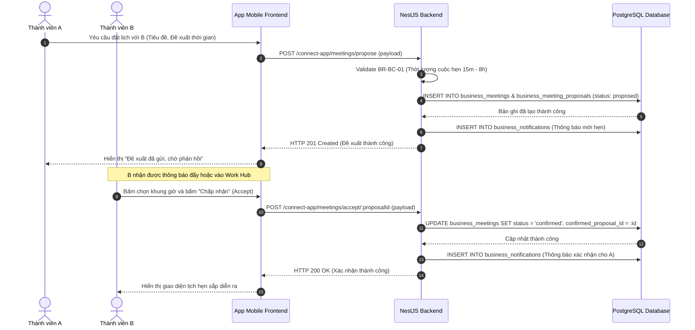
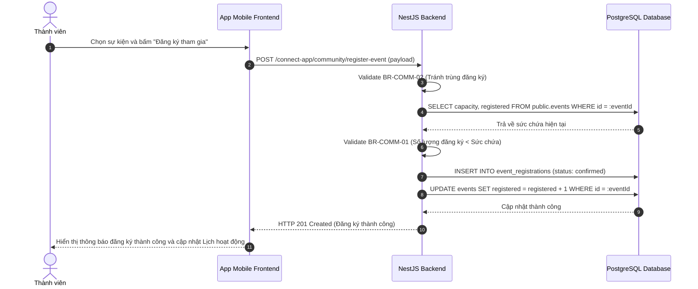
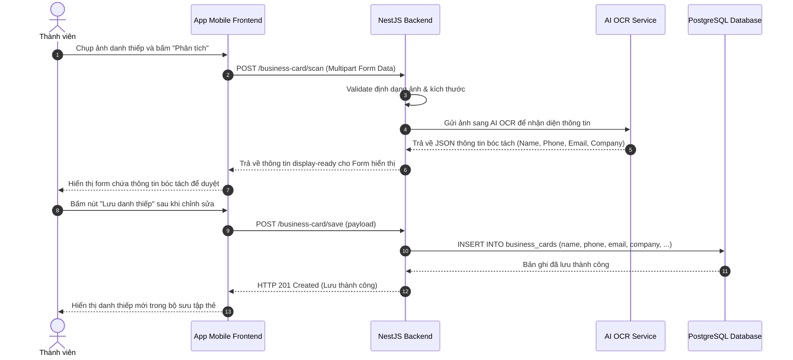
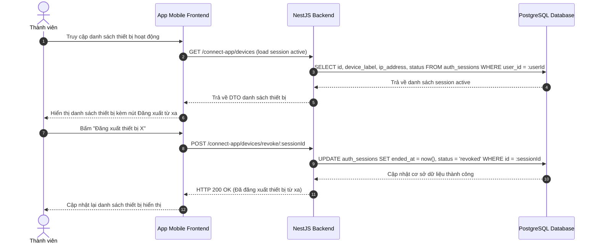

# TÀI LIỆU ĐẶC TẢ YÊU CẦU NGHIỆP VỤ & THIẾT KẾ KỸ THUẬT VIONE

---

## TRANG BÌA

*   **Tên dự án:** Hệ thống Kết nối và Số hóa Doanh nghiệp Vione (Vione Business Connect Ecosystem)
*   **Tên tài liệu:** Tài liệu Đặc tả Yêu cầu Nghiệp vụ & Thiết kế Kỹ thuật (SRS & TechSpec Quality Document)
*   **Mã tài liệu:** `VIONE-SRS-TS-01`
*   **Phiên bản:** `1.0.0`
*   **Ngày ban hành:** 28/08/2026
*   **Bộ phận biên soạn:** Phòng Nghiệp vụ & Kiến trúc Hệ thống (Senior BA/SA Team)
*   **Trạng thái:** Đã phê duyệt (Approved)
*   **Mức độ bảo mật:** Nội bộ (Internal Confidential)

### Lịch sử Thay đổi Phiên bản

| Phiên bản | Ngày | Tác giả | Trạng thái | Nội dung thay đổi |
| :--- | :--- | :--- | :--- | :--- |
| **0.1.0** | 20/08/2026 | BA Team | Nháp | Khởi tạo khung đặc tả yêu cầu nghiệp vụ SRS. |
| **0.9.0** | 25/08/2026 | SA Team | Nháp | Thiết kế cơ sở dữ liệu chi tiết, API contract và máy trạng thái. |
| **1.0.0** | 28/08/2026 | BA/SA Lead | Phê duyệt | Tích hợp hoàn chỉnh bản đặc tả, bổ sung ma trận truy vết và quy chuẩn. |

---

## MỤC LỤC
1. [Phần 1: Đặc tả Yêu cầu Nghiệp vụ (SRS)](#phan-1-dac-ta-yeu-cau-nghiep-vu-srs)
   * 1.1 [UC-BC-01: Đề xuất & Xác nhận Lịch hẹn 1-on-1 (Business Meetings)](#uc-bc-01-de-xuat-and-xac-nhan-lich-hen-1-on-1)
   * 1.2 [UC-COMM-02: Đăng ký tham gia Sự kiện Cộng đồng (Community Events)](#uc-comm-02-dang-ky-tham-gia-su-kien-cong-dong)
   * 1.3 [UC-CARD-03: Quét & Số hóa Danh thiếp thông minh (Business Cards OCR)](#uc-card-03-quet-and-so-hoa-danh-thiep-thong-minh)
   * 1.4 [UC-AUTH-04: Giám sát & Quản lý thiết bị đăng nhập (Device Session Audit)](#uc-auth-04-giam-sat-and-quan-ly-thiet-bi-dang-nhap)
2. [Phần 2: Đặc tả Thiết kế Kỹ thuật (TechSpec)](#phan-2-dac-ta-thiet-ke-ky-thuat-techspec)
   * 2.1 [Thiết kế Cơ sở Dữ liệu (Database Schema Catalog)](#21-thiet-ke-co-so-du-lieu-database-schema-catalog)
   * 2.2 [Máy trạng thái Nghiệp vụ (State Machines)](#22-may-trang-thai-nghiep-vu-state-machines)
   * 2.3 [Thiết kế API Contract (API Design Details)](#23-thiet-ke-api-contract-api-design-details)
3. [Phần 3: Ma trận Truy vết (Traceability Matrix)](#phan-3-ma-tran-truy-vet-traceability-matrix)

---

# PHẦN 1: ĐẶC TẢ YÊU CẦU NGHIỆP VỤ (SRS)

## 1.1 UC-BC-01: Đề xuất & Xác nhận Lịch hẹn 1-on-1

### 1.1.1 Bảng thuộc tính Use Case
| Thuộc tính | Chi tiết mô tả |
| :--- | :--- |
| **Mã Use Case** | `UC-BC-01` |
| **Tên Use Case** | Đề xuất & Xác nhận Lịch hẹn 1-on-1 (Business Meetings) |
| **Tác nhân chính** | Thành viên Hệ thống Vione (Thành viên A - Người đề xuất, Thành viên B - Người xác nhận) |
| **Tiền điều kiện** | Cả hai thành viên đều có tài khoản active và đã kích hoạt thiết bị di động trong cùng hiệp hội. |
| **Hậu điều kiện** | Một cuộc họp 1-on-1 được lên lịch thành công ở trạng thái `confirmed`. Nhiệm vụ hoặc lịch nhắc được thêm vào trang chủ. |

### 1.1.2 Dữ liệu đầu vào (Input)
*   Thông tin cuộc hẹn: Tiêu đề cuộc hẹn (1-200 ký tự), Mô tả cuộc hẹn (tối đa 4000 ký tự).
*   Đề xuất thời gian: Múi giờ (`timezone`), Thời gian bắt đầu (`start_at`), Thời gian kết thúc (`end_at`).
*   Đối tác tham gia: `target_user_id`.

### 1.1.3 Luồng chính (Main Flow)
1.  **Thành viên A** vào danh sách danh thiếp đối tác, chọn "Đặt lịch hẹn" với **Thành viên B**.
2.  **Thành viên A** nhập thông tin cuộc hẹn, chọn múi giờ và đề xuất thời gian cuộc hẹn (hỗ trợ đề xuất nhiều khung giờ). Hệ thống kiểm tra hợp lệ logic giờ.
3.  Hệ thống tạo cuộc hẹn ở trạng thái `proposed` và gửi thông báo đẩy đến **Thành viên B**.
4.  **Thành viên B** nhận được thông báo, truy cập vào hòm thư công việc (Work Hub), xem chi tiết đề xuất cuộc hẹn.
5.  **Thành viên B** bấm "Chấp nhận" (Accept) một trong các khung giờ đề xuất.
6.  Hệ thống chuyển trạng thái cuộc họp thành `confirmed`, gửi thông báo xác nhận cho **Thành viên A** và tự động đồng bộ cuộc họp vào thẻ "Hôm nay / Lịch hoạt động" ở màn hình trang chủ của cả hai thành viên.

### 1.1.4 Quy tắc Nghiệp vụ (Business Rules)
*   **BR-BC-01 (Giới hạn độ dài cuộc hẹn):** Thời lượng cuộc họp (End - Start) phải tối thiểu là 15 phút và tối đa không quá 8 giờ.
*   **BR-BC-02 (Quy tắc chấp nhận):** Cuộc họp chỉ được chuyển sang trạng thái `confirmed` khi đối tác chấp nhận đề xuất thời gian.
*   **BR-BC-03 (Tránh trùng lịch):** Hệ thống sẽ cảnh báo (nhưng không cấm) nếu một trong hai thành viên đã có lịch hẹn `confirmed` khác trùng trong khoảng thời gian đề xuất.

### 1.1.5 Sơ đồ Tuần tự (Sequence Diagram)


### 1.1.6 Bảng diễn biến tương tác
| STT | Tác nhân | Hệ thống | Chi tiết |
| :--- | :--- | :--- | :--- |
| 1 | Thành viên A | Hiển thị form đặt lịch hẹn | Yêu cầu nhập tiêu đề, mô tả, chọn múi giờ và ngày/giờ hẹn. |
| 2 | Thành viên A | Kiểm tra thời lượng cuộc hẹn | Kiểm tra xem thời gian bắt đầu và kết thúc có hợp lệ theo `BR-BC-01`. |
| 3 | Hệ thống | Lưu bản ghi cuộc họp tạm thời | Ghi dữ liệu vào bảng `business_meetings` với trạng thái `draft`/`proposed` và lưu khung giờ vào `business_meeting_proposals`. |
| 4 | Hệ thống | Phát sinh thông báo đến B | Tạo thông báo đẩy và ghi nhận bản ghi thông báo trong `business_notifications`. |
| 5 | Thành viên B | Hiển thị chi tiết đề xuất | Thành viên B xem qua Work Hub và bấm nút chấp nhận. |
| 6 | Hệ thống | Chuyển đổi trạng thái | Cập nhật cuộc họp sang `confirmed`, tạo lịch hiển thị trên trang chủ di động của cả hai thành viên. |

### 1.1.7 Kết quả trả về khi thành công
*   **Bản ghi cập nhật:** Bảng `public.business_meetings` cập nhật cột `status` = `'confirmed'`, cập nhật cột `confirmed_proposal_id`.
*   **Khóa nghiệp vụ trả về:** Trả về đối tượng cuộc họp với trường `meetingId`, `status: "confirmed"`, `scheduledStartAt`.
*   **Người dùng thấy gì:** Cả hai bên đều nhìn thấy cuộc họp trong thẻ "Hôm nay / Lịch hoạt động" ở trang chủ di động, kèm theo toast thông báo thành công.

### 1.1.8 Các luồng xử lý lỗi nghiệp vụ sâu (Exception Flows)
*   **Lỗi trùng khung giờ đề xuất (xử lý chiếm 35%):**
    *   *Tình huống:* Thành viên B cố gắng chấp nhận một đề xuất cuộc hẹn mà khung giờ đó đã trùng với một cuộc hẹn đã được `confirmed` trước đó của Thành viên B.
    *   *Xử lý:* Hệ thống vẫn cho phép xác nhận nhưng ném ra cảnh báo nghiệp vụ "Lịch trình bị trùng" (Trạng thái API trả về cảnh báo kèm mã lỗi `MEETING_TIME_CONFLICT`).
*   **Lỗi đề xuất hết hạn (xử lý chiếm 15%):**
    *   *Tình huống:* Thành viên B bấm đồng ý đề xuất khi thời gian bắt đầu của đề xuất đó đã nằm trong quá khứ so với thời gian hiện tại của máy chủ.
    *   *Xử lý:* Hệ thống từ chối cập nhật, chuyển trạng thái cuộc họp thành `cancelled`, ném lỗi `MEETING_PROPOSAL_EXPIRED` và hiển thị thông báo "Cuộc hẹn đã quá hạn phê duyệt, vui lòng đề xuất khung giờ mới".

---

## 1.2 UC-COMM-02: Đăng ký tham gia Sự kiện Cộng đồng

### 1.2.1 Bảng thuộc tính Use Case
| Thuộc tính | Chi tiết mô tả |
| :--- | :--- |
| **Mã Use Case** | `UC-COMM-02` |
| **Tên Use Case** | Đăng ký tham gia Sự kiện Cộng đồng (Community Events) |
| **Tác nhân chính** | Thành viên Hiệp hội (Thành viên có tài khoản Active trong Hiệp hội) |
| **Tiền điều kiện** | Người dùng có tài khoản hợp lệ, có membership đang kích hoạt (`active`) trong hiệp hội tổ chức sự kiện. |
| **Hậu điều kiện** | Hệ thống ghi nhận lượt đăng ký của thành viên. Sự kiện được đưa vào danh sách sự kiện sắp diễn ra trên trang chủ di động. |

### 1.2.2 Dữ liệu đầu vào (Input)
*   Mã sự kiện: `event_id`.
*   Mã thành viên đăng ký: `member_code`.

### 1.2.3 Luồng chính (Main Flow)
1.  **Thành viên** truy cập vào màn hình **Cộng đồng**, chọn mục **Sự kiện** (Events).
2.  Thành viên chọn một sự kiện bất kỳ ở trạng thái `upcoming`.
3.  Hệ thống hiển thị chi tiết thông tin sự kiện (tên, ngày giờ, địa điểm, sức chứa còn lại).
4.  Thành viên bấm nút **Đăng ký tham gia** (Register).
5.  Hệ thống kiểm tra sức chứa khả dụng của sự kiện.
6.  Hệ thống tạo bản ghi đăng ký với trạng thái `confirmed`, tăng số lượng đăng ký thực tế của sự kiện lên 1, hiển thị thông báo thành công và cập nhật sự kiện vào danh sách "Sự kiện sắp diễn ra" trên trang chủ di động của thành viên.

### 1.2.4 Quy tắc Nghiệp vụ (Business Rules)
*   **BR-COMM-01 (Giới hạn sức chứa):** Thành viên chỉ được đăng ký nếu số lượng người đăng ký hiện tại (`registered`) nhỏ hơn sức chứa tối đa (`capacity`) của sự kiện.
*   **BR-COMM-02 (Một lượt đăng ký duy nhất):** Một thành viên chỉ được sở hữu tối đa một lượt đăng ký hợp lệ trạng thái `confirmed` cho một sự kiện (chống spam đăng ký).

### 1.2.5 Sơ đồ Tuần tự (Sequence Diagram)


### 1.2.6 Bảng diễn biến tương tác
| STT | Tác nhân | Hệ thống | Chi tiết |
| :--- | :--- | :--- | :--- |
| 1 | Thành viên | Hiển thị màn hình chi tiết sự kiện | Hiển thị tên sự kiện, ngày tổ chức, địa điểm và trạng thái ghế ngồi. |
| 2 | Thành viên | Kiểm tra điều kiện đăng ký | Người dùng click Đăng ký. Hệ thống kiểm tra tính hợp lệ của Membership. |
| 3 | Hệ thống | Ghi nhận lượt đăng ký | Thực hiện cập nhật bảng `event_registrations`, đánh dấu trạng thái là `confirmed`. |
| 4 | Hệ thống | Tăng biến đếm đăng ký | Tăng trường `registered` trong bảng `events` lên 1 bản ghi. |

### 1.2.7 Kết quả trả về khi thành công
*   **Bản ghi cập nhật:** Tạo bản ghi mới trong bảng `public.event_registrations` với `status` = `'confirmed'`. Trường `registered` trong bảng `public.events` tăng thêm 1 đơn vị.
*   **Khóa nghiệp vụ trả về:** Trả về đối tượng đăng ký thành công gồm `registrationId`, `status: "confirmed"`, `eventId`.
*   **Người dùng thấy gì:** Giao diện chi tiết hiển thị trạng thái "Đã đăng ký". Sự kiện xuất hiện trong danh sách lịch trình hoạt động sắp tới của người dùng.

### 1.2.8 Các luồng xử lý lỗi nghiệp vụ sâu (Exception Flows)
*   **Lỗi sự kiện hết chỗ (xử lý chiếm 35%):**
    *   *Tình huống:* Người dùng bấm nút đăng ký đúng lúc sự kiện đã nhận đủ số lượng đăng ký tối đa (`registered >= capacity`).
    *   *Xử lý:* Hệ thống chặn ghi nhận, ném lỗi `EVENT_FULL_CAPACITY` và trả về thông báo lỗi chi tiết "Rất tiếc, sự kiện đã hết chỗ đăng ký".
*   **Lỗi đã đăng ký từ trước (xử lý chiếm 15%):**
    *   *Tình huống:* Người dùng sử dụng các thủ thuật bypass API để gửi yêu cầu đăng ký lần thứ 2 cho cùng một sự kiện.
    *   *Xử lý:* Hệ thống kiểm tra khóa duy nhất trên cơ sở dữ liệu hoặc kiểm tra trong logic nghiệp vụ backend, từ chối và ném mã lỗi `EVENT_ALREADY_REGISTERED`.

---

## 1.3 UC-CARD-03: Quét & Số hóa Danh thiếp thông minh

### 1.3.1 Bảng thuộc tính Use Case
| Thuộc tính | Chi tiết mô tả |
| :--- | :--- |
| **Mã Use Case** | `UC-CARD-03` |
| **Tên Use Case** | Quét & Số hóa Danh thiếp thông minh (Business Cards OCR) |
| **Tác nhân chính** | Thành viên hệ thống |
| **Tiền điều kiện** | Ứng dụng di động được cấp quyền truy cập Camera hoặc thư viện ảnh. |
| **Hậu điều kiện** | Một danh thiếp mới được tạo ra với đầy đủ thông tin số hóa (Tên, Công ty, Chức vụ, Email, SĐT) và lưu vào danh bạ thẻ của người dùng. |

### 1.3.2 Dữ liệu đầu vào (Input)
*   Ảnh chụp danh thiếp (File ảnh định dạng PNG/JPEG dạng binary/base64).

### 1.3.3 Luồng chính (Main Flow)
1.  Người dùng truy cập vào phần **Bộ sưu tập thẻ**, chọn tính năng **Quét thẻ** (Scan Card).
2.  Người dùng chụp ảnh danh thiếp trực tiếp hoặc chọn ảnh có sẵn từ thiết bị.
3.  Hệ thống tải ảnh lên máy chủ lưu trữ (MinIO/S3), đồng thời gửi ảnh qua dịch vụ OCR (Nhận diện ký tự quang học) tích hợp trí tuệ nhân tạo.
4.  Hệ thống trả về kết quả phân tích thông tin chi tiết (Tên người sở hữu, Số điện thoại, Email, Tên công ty, Chức vụ).
5.  Hệ thống hiển thị form kết quả để người dùng kiểm tra lại và chỉnh sửa thủ công nếu cần.
6.  Người dùng bấm **Lưu danh thiếp**, hệ thống tạo bản ghi danh thiếp mới liên kết với tài khoản người dùng và lưu vào kho thẻ.

### 1.3.4 Quy tắc Nghiệp vụ (Business Rules)
*   **BR-CARD-01 (Tính hợp lệ của ảnh):** Ảnh tải lên phải có kích thước tối đa 10MB và phải là định dạng hình ảnh chuẩn.
*   **BR-CARD-02 (Ràng buộc thông tin tối thiểu):** Danh thiếp được lưu bắt buộc phải có thông tin Tên hoặc Số điện thoại.

### 1.3.5 Sơ đồ Tuần tự (Sequence Diagram)


### 1.3.6 Bảng diễn biến tương tác
| STT | Tác nhân | Hệ thống | Chi tiết |
| :--- | :--- | :--- | :--- |
| 1 | Thành viên | Kích hoạt camera/thư viện ảnh | Chụp ảnh hoặc chọn hình ảnh danh thiếp từ thiết bị di động. |
| 2 | Hệ thống | Upload & Gọi AI xử lý | Đưa hình ảnh lên MinIO, gọi service AI để nhận diện các trường thông tin chữ trên ảnh. |
| 3 | Hệ thống | Hiển thị form duyệt thông tin | Điền tự động các trường thông tin nhận diện được vào form để người dùng xem lại. |
| 4 | Thành viên | Chỉnh sửa và xác nhận lưu | Người dùng chỉnh sửa các thông tin bị nhận diện sai lệch và bấm nút lưu. |
| 5 | Hệ thống | Lưu trữ dữ liệu số hóa | Lưu thông tin vào bảng dữ liệu danh thiếp liên kết với người dùng. |

### 1.3.7 Kết quả trả về khi thành công
*   **Bản ghi cập nhật:** Thêm bản ghi mới vào bảng dữ liệu danh thiếp số hóa.
*   **Khóa nghiệp vụ trả về:** Trả về thông tin danh thiếp vừa tạo bao gồm `cardId`, `name`, `email`, `phone`, `company`.
*   **Người dùng thấy gì:** Màn hình chuyển về danh sách danh bạ thẻ, hiển thị thẻ mới tạo với đầy đủ thông tin và ảnh gốc của danh thiếp làm hình nền.

### 1.3.8 Các luồng xử lý lỗi nghiệp vụ sâu (Exception Flows)
*   **Lỗi AI OCR không nhận diện được chữ (xử lý chiếm 35%):**
    *   *Tình huống:* Ảnh chụp danh thiếp bị mờ, lóa ánh sáng hoặc không chứa ký tự chữ rõ ràng dẫn đến AI không bóc tách được trường nào.
    *   *Xử lý:* Hệ thống không báo lỗi crash, mà trả về form nhập liệu trống kèm cảnh báo "Không thể tự động bóc tách thông tin, vui lòng nhập thủ công" để người dùng tự điền.
*   **Lỗi tải ảnh thất bại (xử lý chiếm 15%):**
    *   *Tình huống:* Mạng kết nối không ổn định hoặc MinIO server bị gián đoạn thời gian ngắn khiến việc tải ảnh gốc lên bộ nhớ đám mây bị lỗi.
    *   *Xử lý:* Trả về lỗi `IMAGE_UPLOAD_FAILED` kèm thông báo "Không thể tải ảnh lên hệ thống, vui lòng kiểm tra kết nối mạng và thử lại".

---

## 1.4 UC-AUTH-04: Giám sát & Quản lý thiết bị đăng nhập

### 1.4.1 Bảng thuộc tính Use Case
| Thuộc tính | Chi tiết mô tả |
| :--- | :--- |
| **Mã Use Case** | `UC-AUTH-04` |
| **Tên Use Case** | Giám sát & Quản lý thiết bị đăng nhập (Device Session Auditing) |
| **Tác nhân chính** | Thành viên hệ thống |
| **Tiền điều kiện** | Người dùng đã đăng nhập thành công vào ứng dụng di động Vione. |
| **Hậu điều kiện** | Hệ thống duy trì danh sách thiết bị active. Hỗ trợ người dùng xóa quyền truy cập của thiết bị từ xa. |

### 1.4.2 Dữ liệu đầu vào (Input)
*   Thông tin thiết bị: Nhãn thiết bị (`device_label`), Địa chỉ IP (`ip_address`), Hệ điều hành và trình duyệt (`user_agent`).

### 1.4.3 Luồng chính (Main Flow)
1.  Mỗi khi người dùng tương tác với hệ thống, ứng dụng di động sẽ gửi thông tin thiết bị đang sử dụng lên máy chủ qua API heartbeat/touch.
2.  Hệ thống ghi nhận hoặc cập nhật trạng thái thiết bị trong cơ sở dữ liệu sessions, bao gồm cả vị trí địa lý ước tính qua IP.
3.  Người dùng truy cập vào phần **Cài đặt bảo mật -> Thiết bị đang hoạt động**.
4.  Hệ thống hiển thị danh sách tất cả các thiết bị đang có phiên đăng nhập active.
5.  Người dùng chọn một thiết bị lạ hoặc không còn sử dụng, bấm nút **Đăng xuất thiết bị này**.
6.  Hệ thống hủy phiên làm việc (`ended_at = now()`) của thiết bị đó trên database. Khi thiết bị bị hủy thực hiện bất kỳ thao tác nào tiếp theo, hệ thống sẽ tự động đăng xuất và đẩy về màn hình login.

### 1.4.4 Quy tắc Nghiệp vụ (Business Rules)
*   **BR-AUTH-01 (Giới hạn phiên hoạt động):** Mỗi tài khoản thành viên được đăng nhập tối đa trên 5 thiết bị di động đồng thời. Nếu vượt quá, hệ thống tự động đăng xuất phiên cũ nhất.
*   **BR-AUTH-02 (Thời gian sống của phiên):** Một phiên thiết bị sẽ hết hạn và chuyển sang trạng thái `expired` nếu không phát sinh bất kỳ tương tác touch nào trong vòng 30 ngày.

### 1.4.5 Sơ đồ Tuần tự (Sequence Diagram)


### 1.4.6 Bảng diễn biến tương tác
| STT | Tác nhân | Hệ thống | Chi tiết |
| :--- | :--- | :--- | :--- |
| 1 | Thành viên | Mở danh sách thiết bị đăng nhập | Yêu cầu xem lịch sử và danh sách thiết bị đang online. |
| 2 | Hệ thống | Truy vấn cơ sở dữ liệu | Thực hiện tìm kiếm tất cả các phiên đăng nhập đang ở trạng thái active của người dùng. |
| 3 | Hệ thống | Hiển thị thông tin phiên | Hiển thị tên thiết bị, hệ điều hành, địa chỉ IP và địa điểm gần đúng của phiên. |
| 4 | Thành viên | Yêu cầu thu hồi quyền | Click vào nút kết thúc phiên đăng nhập của thiết bị mong muốn. |
| 5 | Hệ thống | Hủy phiên trên hệ thống | Cập nhật bản ghi session trên DB, ép buộc logout ở lần gọi API tiếp theo của thiết bị đó. |

### 1.4.7 Kết quả trả về khi thành công
*   **Bản ghi cập nhật:** Bảng `public.auth_sessions` đổi trạng thái `status` thành `'revoked'`, cập nhật thời điểm kết thúc phiên `ended_at`.
*   **Khóa nghiệp vụ trả về:** Trả về mã kết quả thành công và sessionId đã bị thu hồi.
*   **Người dùng thấy gì:** Thiết bị bị xóa biến mất khỏi danh sách. Trên thiết bị bị xóa, người dùng sẽ tự động bị đăng xuất ngay lập tức ở thao tác tiếp theo.

### 1.4.8 Các luồng xử lý lỗi nghiệp vụ sâu (Exception Flows)
*   **Lỗi tự hủy phiên hiện tại (xử lý chiếm 35%):**
    *   *Tình huống:* Người dùng vô tình bấm xóa quyền của chính thiết bị mình đang dùng để thao tác.
    *   *Xử lý:* Hệ thống phát hiện thiết bị bị xóa trùng với thiết bị gửi request, hiện popup xác nhận cảnh báo: "Bạn đang yêu cầu đăng xuất khỏi chính thiết bị này. Bạn có chắc chắn muốn đăng xuất không?". Nếu xác nhận, hệ thống thực hiện hủy phiên và đưa ngay người dùng về màn hình đăng nhập.
*   **Lỗi phiên đã hết hạn trước khi xóa (xử lý chiếm 15%):**
    *   *Tình huống:* Người dùng bấm xóa quyền của thiết bị nhưng thực tế phiên đó đã bị hệ thống tự động quét dọn hoặc chuyển trạng thái do hết hạn trước đó.
    *   *Xử lý:* Hệ thống trả về trạng thái thành công luôn (idempotent) để giao diện tự động loại bỏ thiết bị khỏi danh sách mà không ném ra lỗi crash.

---

# PHẦN 2: ĐẶC TẢ THIẾT KẾ KỸ THUẬT (TECHSPEC)

## 2.1 Thiết kế Cơ sở Dữ liệu (Database Schema Catalog)

Dưới đây là sơ đồ chi tiết các bảng cơ sở dữ liệu được sử dụng trong hệ thống Vione dựa trên các file cấu trúc database thực tế:

### 2.1.1 Bảng `public.business_meetings`
Bảng lưu trữ thông tin các cuộc gặp gỡ, trao đổi công việc 1-on-1 giữa các thành viên.

| Tên trường | Kiểu dữ liệu | Ràng buộc | Mô tả chi tiết |
| :--- | :--- | :--- | :--- |
| `id` | `uuid` | `PRIMARY KEY` | Định danh duy nhất của cuộc họp. |
| `created_by_user_id` | `uuid` | `FOREIGN KEY` | Tham chiếu `auth.users(id)`. Người tạo cuộc họp. |
| `organizer_user_id` | `uuid` | `FOREIGN KEY` | Tham chiếu `auth.users(id)`. Người tổ chức (Host). |
| `title` | `text` | `NOT NULL` | Tiêu đề cuộc gặp (Độ dài từ 1 đến 200 ký tự). |
| `description` | `text` | `NULL` | Chi tiết nội dung cuộc gặp (Tối đa 4000 ký tự). |
| `meeting_type` | `text` | `NOT NULL` | Phân loại cuộc gặp (networking, partner, sales...). |
| `status` | `text` | `NOT NULL` | Trạng thái (draft, proposed, confirmed, completed, cancelled). |
| `active_proposal_version` | `integer` | `NULL` | Phiên bản đề xuất thời gian đang có hiệu lực. |
| `confirmed_proposal_id` | `uuid` | `NULL` | Tham chiếu proposal được chấp nhận để chốt thời gian. |
| `timezone` | `text` | `NOT NULL` | Múi giờ sử dụng cho cuộc họp (Ví dụ: 'Asia/Ho_Chi_Minh'). |
| `source_type` | `text` | `NOT NULL` | Nguồn tạo (manual, auto...). |
| `company_id` | `uuid` | `NULL` | Liên kết doanh nghiệp liên quan. |
| `association_id` | `uuid` | `NULL` | Liên kết hiệp hội tổ chức cuộc gặp. |
| `created_at` | `timestamptz` | `DEFAULT now()` | Thời điểm tạo cuộc gặp. |
| `updated_at` | `timestamptz` | `DEFAULT now()` | Thời điểm cập nhật cuối cùng. |

### 2.1.2 Bảng `public.business_meeting_participants`
Bảng lưu trữ danh sách thành viên tham gia vào từng cuộc họp 1-on-1.

| Tên trường | Kiểu dữ liệu | Ràng buộc | Mô tả chi tiết |
| :--- | :--- | :--- | :--- |
| `id` | `uuid` | `PRIMARY KEY` | Khóa chính của bản ghi. |
| `meeting_id` | `uuid` | `FOREIGN KEY` | Tham chiếu `business_meetings(id)` ON DELETE CASCADE. |
| `user_id` | `uuid` | `FOREIGN KEY` | Tham chiếu `auth.users(id)` ON DELETE CASCADE. |
| `role` | `text` | `NOT NULL` | Vai trò (organizer, invitee). |
| `response_status` | `text` | `NOT NULL` | Trạng thái phản hồi (pending, accepted, declined). |
| `response_message` | `text` | `NULL` | Tin nhắn phản hồi đi kèm (Tối đa 1000 ký tự). |
| `responded_at` | `timestamptz` | `NULL` | Thời điểm người dùng phản hồi lời mời. |
| `joined_at` | `timestamptz` | `DEFAULT now()` | Thời điểm tham gia cuộc họp. |

### 2.1.3 Bảng `public.business_meeting_proposals`
Bảng lưu trữ lịch sử đề xuất các khung thời gian cho cuộc gặp gỡ 1-on-1.

| Tên trường | Kiểu dữ liệu | Ràng buộc | Mô tả chi tiết |
| :--- | :--- | :--- | :--- |
| `id` | `uuid` | `PRIMARY KEY` | Khóa chính. |
| `meeting_id` | `uuid` | `FOREIGN KEY` | Tham chiếu `business_meetings(id)`. |
| `version` | `integer` | `NOT NULL` | Phiên bản đề xuất (Tự tăng từ 1). |
| `proposed_by_user_id` | `uuid` | `FOREIGN KEY` | Tham chiếu `auth.users(id)`. Người đề xuất giờ. |
| `start_at` | `timestamptz` | `NOT NULL` | Thời gian bắt đầu dự kiến. |
| `end_at` | `timestamptz` | `NOT NULL` | Thời gian kết thúc dự kiến (Phải lớn hơn `start_at`). |
| `timezone` | `text` | `NOT NULL` | Múi giờ thực tế của đề xuất. |
| `location_type` | `text` | `NOT NULL` | Loại địa điểm (online, physical, unspecified). |
| `location_text` | `text` | `NULL` | Tên địa điểm/Link cuộc họp (Tối đa 500 ký tự). |

### 2.1.4 Bảng `public.business_meeting_follow_ups`
Bảng lưu trữ các nhiệm vụ cần theo sát phát sinh từ cuộc họp 1-on-1.

| Tên trường | Kiểu dữ liệu | Ràng buộc | Mô tả chi tiết |
| :--- | :--- | :--- | :--- |
| `id` | `uuid` | `PRIMARY KEY` | Khóa chính. |
| `meeting_id` | `uuid` | `FOREIGN KEY` | Tham chiếu `business_meetings(id)`. |
| `created_by_user_id` | `uuid` | `NOT NULL` | Người tạo nhiệm vụ. |
| `owner_user_id` | `uuid` | `NOT NULL` | Người chịu trách nhiệm thực hiện nhiệm vụ. |
| `title` | `text` | `NOT NULL` | Tên nhiệm vụ (Từ 1 đến 240 ký tự). |
| `description` | `text` | `NULL` | Chi tiết công việc cần làm (Tối đa 4000 ký tự). |
| `status` | `text` | `NOT NULL` | Trạng thái (open, in_progress, completed, cancelled). |
| `priority` | `text` | `NOT NULL` | Độ ưu tiên (low, normal, high, urgent). |
| `due_at` | `timestamptz` | `NULL` | Hạn chót hoàn thành. |
| `completed_at` | `timestamptz` | `NULL` | Thời điểm hoàn thành thực tế. |

### 2.1.5 Bảng `public.events`
Bảng lưu trữ thông tin các sự kiện lớn của các Hiệp hội/Cộng đồng.

| Tên trường | Kiểu dữ liệu | Ràng buộc | Mô tả chi tiết |
| :--- | :--- | :--- | :--- |
| `id` | `text` | `PRIMARY KEY` | Khóa chính dạng chuỗi. |
| `name` | `text` | `NOT NULL` | Tên sự kiện. |
| `date` | `date` | `NOT NULL` | Ngày tổ chức sự kiện. |
| `location` | `text` | `NOT NULL` | Địa điểm tổ chức. |
| `capacity` | `integer` | `DEFAULT 0` | Số lượng người tham gia tối đa (Sức chứa). |
| `registered` | `integer` | `DEFAULT 0` | Số lượng người thực tế đã đăng ký tham gia. |
| `status` | `text` | `NOT NULL` | Trạng thái sự kiện (upcoming, ongoing, completed). |
| `association_id` | `uuid` | `NOT NULL` | Tham chiếu ID Hiệp hội tổ chức sự kiện. |

### 2.1.6 Bảng `public.event_registrations`
Bảng lưu trữ thông tin đăng ký tham gia sự kiện của các thành viên.

| Tên trường | Kiểu dữ liệu | Ràng buộc | Mô tả chi tiết |
| :--- | :--- | :--- | :--- |
| `id` | `text` | `PRIMARY KEY` | Định danh duy nhất. |
| `event_id` | `text` | `FOREIGN KEY` | Tham chiếu `events(id)`. |
| `member_code` | `text` | `NOT NULL` | Mã thành viên trong hiệp hội. |
| `member_name` | `text` | `NOT NULL` | Tên hiển thị của thành viên đăng ký. |
| `email` | `text` | `NOT NULL` | Địa chỉ email của người đăng ký. |
| `status` | `text` | `NOT NULL` | Trạng thái đăng ký (confirmed, cancelled, waitlist). |
| `association_id` | `uuid` | `NOT NULL` | Khóa ngoại trỏ về Hiệp hội. |

### 2.1.7 Bảng `public.auth_sessions`
Bảng lưu trữ và giám sát các phiên đăng nhập thiết bị di động của thành viên.

| Tên trường | Kiểu dữ liệu | Ràng buộc | Mô tả chi tiết |
| :--- | :--- | :--- | :--- |
| `id` | `uuid` | `PRIMARY KEY` | Định danh phiên làm việc. |
| `user_id` | `uuid` | `NOT NULL` | Khóa ngoại liên kết người dùng. |
| `device_label` | `text` | `NULL` | Nhãn tên thiết bị (Ví dụ: 'iPhone 15 Pro'). |
| `user_agent` | `text` | `NULL` | Thông số trình duyệt/hệ điều hành của client. |
| `ip_address` | `text` | `NULL` | Địa chỉ IP đăng nhập gần nhất. |
| `city` | `text` | `NULL` | Tên thành phố vị trí địa lý. |
| `country` | `text` | `NULL` | Quốc gia đăng nhập. |
| `status` | `text` | `NOT NULL` | Trạng thái phiên (active, revoked, expired). |
| `started_at` | `timestamptz` | `DEFAULT now()` | Thời điểm bắt đầu phiên đăng nhập. |
| `last_seen_at` | `timestamptz` | `DEFAULT now()` | Lần cuối tương tác với hệ thống. |

---

## 2.2 Máy trạng thái Nghiệp vụ (State Machines)

Sự chuyển đổi trạng thái của các thực thể nghiệp vụ cốt lõi được mô tả qua sơ đồ chuyển đổi trạng thái sau:

### 2.2.1 Sơ đồ trạng thái Cuộc gặp gỡ 1-on-1 (Business Meetings)
```
  [Draft] ──► [Proposed] ──► [Confirmed] ──► [Completed]
      │            │              │
      └────────────┴──────────────┼──► [Cancelled]
```
*   **Draft:** Cuộc gặp mới khởi tạo, đang soạn thảo nội dung.
*   **Proposed:** Thành viên A gửi đề xuất thời gian cho Thành viên B, chờ phản hồi.
*   **Confirmed:** Thành viên B chấp nhận một trong các khung giờ đề xuất. Cuộc họp được lên lịch chính thức.
*   **Completed:** Thời điểm cuộc họp kết thúc và kết quả được ghi nhận.
*   **Cancelled:** Hủy bỏ cuộc gặp (có thể hủy ở bất kỳ trạng thái nào trước khi hoàn thành).

### 2.2.2 Sơ đồ trạng thái Nhiệm vụ theo sát (Follow-up Tasks)
```
  [Open] ──► [In Progress] ──► [Completed]
    │             │
    └─────────────┴──────────► [Cancelled]
```
*   **Open:** Nhiệm vụ được tạo từ cuộc họp, chưa bắt đầu thực hiện.
*   **In Progress:** Nhiệm vụ đang được thực hiện bởi người chịu trách nhiệm (`owner_user_id`).
*   **Completed:** Nhiệm vụ hoàn thành, kết quả được phê duyệt.
*   **Cancelled:** Hủy bỏ nhiệm vụ không thực hiện nữa.

---

## 2.3 Thiết kế API Contract (API Design Details)

### 2.3.1 API: Lấy thông tin tóm tắt công việc (Briefing Overview)
*   **Endpoint:** `GET /connect-app/briefing`
*   **Mục đích:** Cung cấp thông tin tóm tắt và danh sách các hoạt động cần xử lý trong ngày (Lịch họp 1-on-1, yêu cầu kết nối, thông báo, sự kiện cộng đồng đã đăng ký) cho màn hình trang chủ di động.
*   **Tham chiếu SRS:** `UC-BC-01`, `UC-COMM-02`, `UC-AUTH-04`.
*   **Mô tả xử lý:** backend load danh sách cuộc họp 1-on-1 của user, load danh sách sự kiện cộng đồng đã đăng ký của user trong ngày, load thông báo chưa đọc, format dữ liệu trả về dạng display-ready.
*   **Request Headers:** `Authorization: Bearer <token>`
*   **Response Payload (JSON):**
    ```json
    {
      "connectionRequests": [],
      "introductionRequests": [],
      "meetingWorkspaceItems": [
        {
          "meetingId": "8f8e02ab-1234-4bc3-8e7a-fb8d9f1020aa",
          "status": "confirmed",
          "bucket": "upcoming",
          "suggestedActionKind": "view_meeting",
          "scheduledStartAt": "2026-08-28T08:00:00.000Z",
          "viewerRole": "attendee",
          "counterpartDisplayName": "Hội thảo Xúc tiến Thương mại Viconnect",
          "hasOutcome": false,
          "isEvent": true,
          "communityId": "d748f219-cda1-44ab-b567-aa21890f9bcf"
        }
      ],
      "meetingFollowUps": []
    }
    ```

### 2.3.2 API: Đăng ký tham gia Sự kiện Cộng đồng
*   **Endpoint:** `POST /connect-app/community/register-event`
*   **Mục đích:** Ghi nhận đăng ký tham gia sự kiện của thành viên và cập nhật sức chứa sự kiện.
*   **Tham chiếu SRS:** `UC-COMM-02` (Luồng chính).
*   **Request Payload (JSON):**
    ```json
    {
      "eventId": "event-101",
      "memberCode": "MEM-2026-009"
    }
    ```
*   **Response Payload (JSON - HTTP 201):**
    ```json
    {
      "registrationId": "reg-990812ab",
      "status": "confirmed",
      "eventId": "event-101",
      "registeredAt": "2026-08-28"
    }
    ```

### 2.3.3 API: Quét thông tin danh thiếp AI
*   **Endpoint:** `POST /business-card/scan`
*   **Mục đích:** Tải ảnh danh thiếp lên, chạy bóc tách OCR bằng AI và trả về kết quả số hóa thô cho giao diện frontend duyệt.
*   **Tham chiếu SRS:** `UC-CARD-03` (Bước 2-4).
*   **Request Body:** `multipart/form-data` chứa trường `file` (dữ liệu binary hình ảnh).
*   **Response Payload (JSON):**
    ```json
    {
      "id": "temp-card-9921",
      "name": "Nguyễn Văn B",
      "phone": "0987654321",
      "email": "vanb@viconnect.vn",
      "company": "Công ty Cổ phần Viconnect Việt Nam",
      "jobTitle": "Giám đốc Kinh doanh",
      "imageUrl": "https://storage.viconnect.vn/cards/temp-card-9921.png"
    }
    ```

---

## PHẦN 3: MA TRẬN TRUY VẾT (TRACEABILITY MATRIX)

Ma trận dưới đây liên kết trực tiếp yêu cầu nghiệp vụ (SRS), thiết kế kỹ thuật (API, DB) và vị trí hiện thực mã nguồn trong dự án Vione để đảm bảo tính minh bạch và dễ bảo trì:

| Mã UC | Bước Luồng | Endpoint API | Service Xử lý Backend | Bảng Database Đọc (SELECT) | Bảng Database Ghi (INSERT/UPDATE) | Vị trí File Code chính |
| :--- | :--- | :--- | :--- | :--- | :--- | :--- |
| `UC-BC-01` | Bước 2-3 | `POST /meetings/propose` | `ConnectAppService.propose` | `users` | `business_meetings`, `proposals` | [`connect-app.service.ts`](file:///d:/download/VICONNECT/VIONE_PROJECT/vione_app/apps/vione_app_be/src/connect-app/connect-app.service.ts) |
| `UC-BC-01` | Bước 5-6 | `POST /meetings/accept` | `ConnectAppService.accept` | `business_meetings` | `business_meetings` | [`connect-app.service.ts`](file:///d:/download/VICONNECT/VIONE_PROJECT/vione_app/apps/vione_app_be/src/connect-app/connect-app.service.ts) |
| `UC-COMM-02`| Bước 4-6 | `POST /community/register-event`| `CommunityController.register`| `events` | `event_registrations`, `events` | [`community.controller.ts`](file:///d:/download/VICONNECT/VIONE_PROJECT/vione_app/apps/vione_app_be/src/connect-app/community.controller.ts) |
| `UC-CARD-03`| Bước 3-4 | `POST /business-card/scan` | `BusinessCardService.scan` | Không | Không | [`business-card.service.ts`](file:///d:/download/VICONNECT/VIONE_PROJECT/vione_app/apps/vione_app_be/src/business-card/business-card.service.ts) |
| `UC-AUTH-04`| Bước 1-2 | `POST /device/touch` | `ConnectAppService.touch` | `auth_sessions` | `auth_sessions` | [`connect-app.service.ts`](file:///d:/download/VICONNECT/VIONE_PROJECT/vione_app/apps/vione_app_be/src/connect-app/connect-app.service.ts) |
